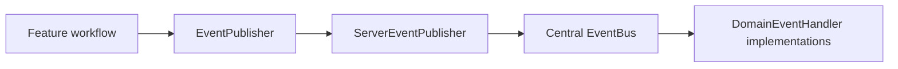
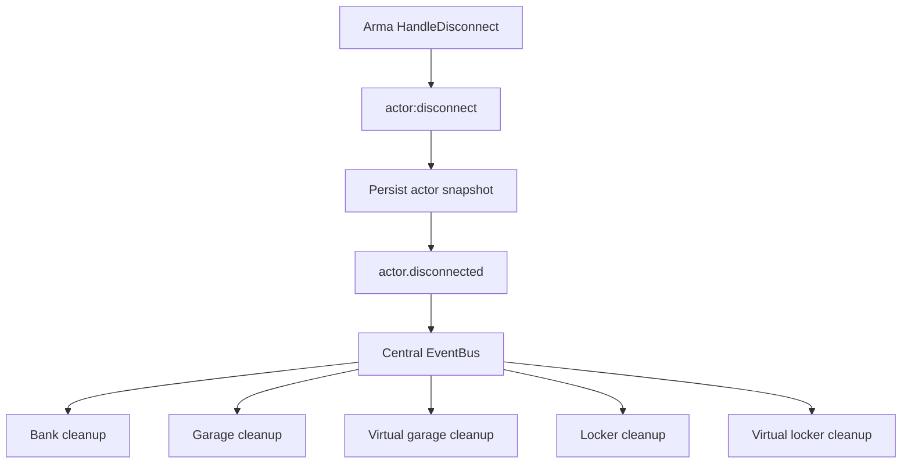
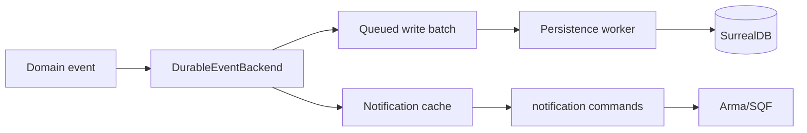

# Events, Audit, and Notifications

The Rust server uses domain events for cross-cutting side effects such as durable audit rows and notifications.

## Core Types

Shared event code lives in `lib/src/events`.

- `DomainEventHandler`: trait for subscribers.
- `EventBus`: dispatches events to registered handlers.
- `EventPublisher`: interface used by feature workflows.

Domain events live in `lib/src/models`:

- `domain_event.rs`: central `DomainEvent` enum.
- `actor_event.rs`: actor event payloads.
- `organization_event.rs`: organization event payloads.

Audit and notification records live in:

- `notification.rs`

## Server Event Backbone

The server owns one central event bus in `arma/crate/src/events.rs`.



At startup, `lib.rs` calls:

```rust
events::init();
```

The event bus currently subscribes:

- `persistence::DurableEventBackend`
- bank actor-disconnect cleanup
- garage and virtual-garage actor-disconnect cleanup
- locker and virtual-locker actor-disconnect cleanup

Actor disconnect uses one Arma entry point:



Each handler runs independently. A failed cleanup is logged without preventing the remaining handlers from receiving the event.

Locker close uses correlated CBA events to save actor state before locker state without either domain handling the other's payload. After the locker save succeeds, Rust publishes `locker.transfer_committed`. The durable event backend records the event and a compact audit entry containing the player UID, distinct classname count, and total item quantity.

## Durable Event Backend

The durable backend lives in:

```text
arma/crate/src/persistence/durable_events.rs
```

For each domain event, it queues a batch write that may include:

- one `domain_event` record containing the raw event payload.
- one `audit_record` if the event is auditable.
- one or more `notification` records if players should be notified.

The queued writes are handled by the persistence worker.

Notification rows are also cached in the server notification repository when the durable backend creates them. This lets SQF fetch newly-created notifications immediately without waiting for the background database writer.



## Arma/SQF Notification Surface

The Rust extension exposes these notification commands:

- `notification:list`
- `notification:unread`
- `notification:mark_read`
- `notification:mark_all_read`

The server SQF addon wraps those commands in:

```text
arma/crate/addons/notification/functions
```

Current helper functions:

- `forge_crate_notification_fnc_list`
- `forge_crate_notification_fnc_unread`
- `forge_crate_notification_fnc_markRead`
- `forge_crate_notification_fnc_markAllRead`
- `forge_crate_notification_fnc_deliver`

`deliver` fetches unread notifications for a player and sends them to that player with `systemChat`. The bank player-init flow calls it after bank initialization and marks displayed notifications read, so players do not see the same join-time notifications repeatedly. A later UI can replace `deliver` with a custom inbox while keeping the same Rust command surface.

## Arma Extension Callbacks

SQF extension callbacks are registered once in:

```text
arma/crate/addons/main/XEH_preInitServer.sqf
```

The handler accepts Forge-owned callback namespaces:

- `forge:<feature>` for new callback producers.

The callback payload is parsed with `fromJSON` when it looks like a JSON object or array. The bridge then emits a server-local CBA event named:

```text
forge_crate_<feature>_<callback>
```

For example, this extension callback:

```text
name = "forge:refuel"
function = "price"
data = "[...]"
```

becomes this SQF event:

```text
forge_crate_refuel_price
```

Feature addons should subscribe to the routed CBA event in their own `XEH_preInitServer.sqf`. They should not add separate raw `ExtensionCallback` handlers unless a callback uses a different non-Forge protocol.

## Current Events

Actor:

- `actor.created`
- `actor.disconnected`

Organization:

- `organization.created`
- `organization.disbanded`
- `organization.invite_created`
- `organization.invite_accepted`
- `organization.invite_declined`
- `organization.member_left`
- `organization.member_kicked`
- `organization.payday_issued`

## Publishing Events

Feature workflows should publish through the `EventPublisher` interface.

Example pattern:

```rust
let organization = self.service.create_player_org(id, name, ceo_uid)?;
self.events.publish(DomainEvent::OrganizationCreated(
    OrganizationCreated::new(OrganizationView::from(&organization), ceo_uid),
));
```

Command modules should not publish directly unless they are truly the workflow owner. Prefer keeping event publication inside `features`.

## Adding a New Event

1. Add the event payload to a domain-specific event file, such as `organization_event.rs`.
2. Add a variant to `DomainEvent` in `domain_event.rs`.
3. Add the event name in `DomainEvent::name`.
4. Export the payload from `models/mod.rs`.
5. Publish it from the relevant feature workflow through `EventPublisher`.
6. Add durable side effects in `persistence/durable_events.rs` if audit or notification rows are needed.
7. Add tests around the service or feature workflow behavior.

## Design Guidelines

- Events should describe something that already happened.
- Do not use an event to ask permission.
- Validate and mutate domain state first, then publish the event.
- Keep durable side effects in event handlers.
- Keep core domain logic out of event handlers.
