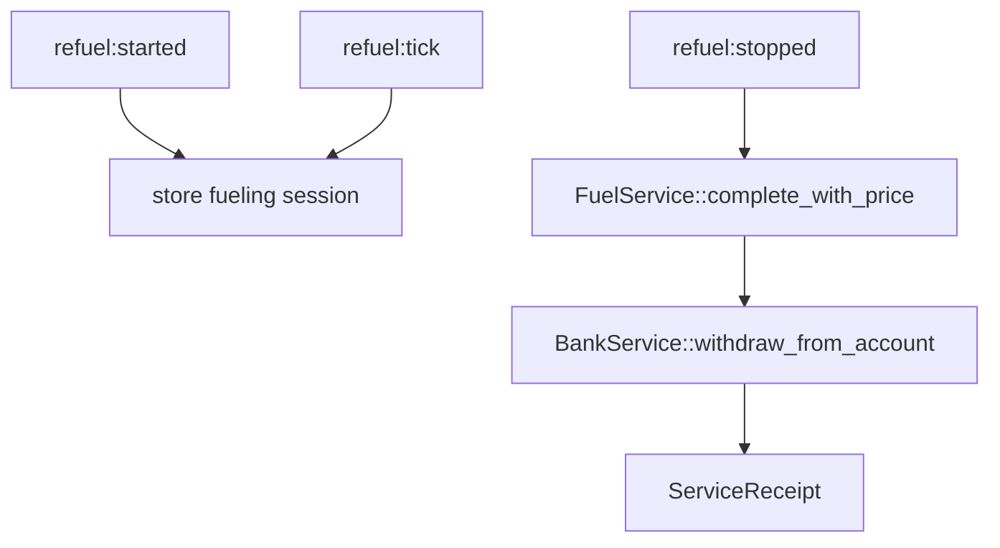
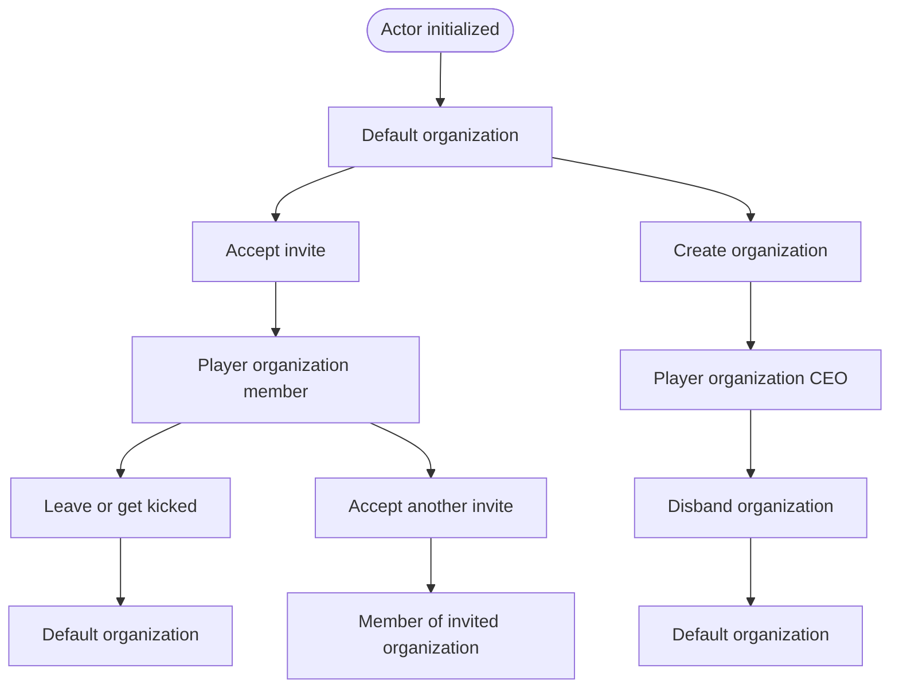
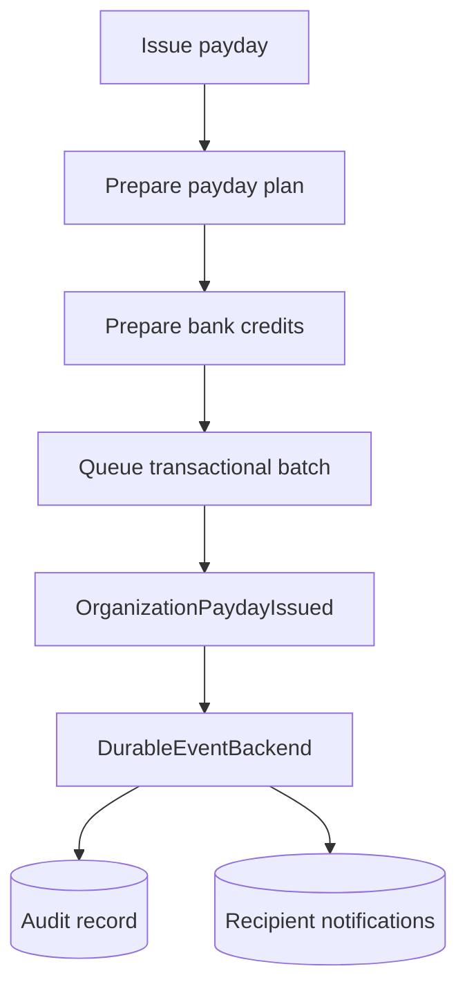

# Feature Guide

This page summarizes the current Rust server features and the main files involved.

## Actor

Main files:

- `lib/src/models/actor.rs`
- `lib/src/services/actor.rs`
- `arma/crate/src/actor.rs`
- `arma/crate/src/features/actor/*`

Actor init accepts an `ActorSnapshot`. If the actor is new, `ActorService::init_or_create` creates it and returns an `ActorCreated` domain event. The actor feature publishes that event through the central event bus.

Actor disconnect persists the live player snapshot and publishes `ActorDisconnected`. Bank, garage, locker, and virtual-storage cleanup then fan out through the central event bus.

Actor server workflows are organized as vertical slices:

- `init.rs`: init or create actor.
- `lifecycle.rs`: disconnect and delete actor.
- `query.rs`: get actor by uid.

Current commands:

- `actor:init`
- `actor:disconnect`
- `actor:get`
- `actor:delete`

## Bank

Main files:

- `lib/src/models/bank.rs`
- `lib/src/services/bank.rs`
- `lib/src/repositories/bank.rs`
- `arma/crate/src/bank.rs`
- `arma/crate/src/features/bank/*`
- `arma/crate/src/persistence/payday.rs`

Bank profiles hold player cash, account balances, pending earnings, a salted ATM PIN hash, and up to ten recent ledger entries. Player bank-account reads and money movement go through `BankService`. Player transfers persist the sender debit and recipient credit in one queued transaction batch. Organization payday applies the organization debit and recipient bank credits the same way, with recipient credits prepared through `BankService` before persistence batches the writes.

The bank WebUI uses a server-authoritative request/response bridge. Browser requests travel through `JSDialog` to SQF, are forwarded to the server, and call the Rust extension using the requesting player's UID. The resulting bank snapshot is returned to that player's browser with `ctrlWebBrowserAction ["ExecJS", ...]`. The UI does not update balances optimistically.

Bank server workflows are organized as:

- `account.rs`: initialize, read, deposit, withdraw, and transfer player bank funds.

Bank disconnect cleanup is an internal `ActorDisconnected` event handler rather than a public extension command.

Current commands:

- `bank:init`
- `bank:get`
- `bank:deposit`
- `bank:withdraw`
- `bank:transfer`
- `bank:add_earnings`
- `bank:submit_earnings`
- `bank:change_pin`

## Garage and Locker

Main files:

- `lib/src/models/garage.rs`
- `lib/src/models/locker.rs`
- `lib/src/models/v_garage.rs`
- `lib/src/models/v_locker.rs`
- `lib/src/services/garage.rs`
- `lib/src/services/locker.rs`
- `lib/src/services/v_garage.rs`
- `lib/src/services/v_locker.rs`
- `arma/crate/src/garage.rs`
- `arma/crate/src/locker.rs`
- `arma/crate/src/v_garage.rs`
- `arma/crate/src/v_locker.rs`
- `arma/crate/src/features/garage/*`
- `arma/crate/src/features/locker/*`
- `arma/crate/src/features/v_garage/*`
- `arma/crate/src/features/v_locker/*`

Physical garage/locker data and virtual unlock collections are separate models and repositories.

These server workflows use the same slice names:

- `lifecycle.rs`: initialize and delete records.
- `query.rs`: get records by player uid.
- `storage.rs`: save full records.

Current command groups:

- `garage:*`
- `locker:*`
- `v_garage:*`
- `v_locker:*`

Disconnect cleanup is internal to the `ActorDisconnected` event handlers and is not exposed as feature commands.

## Refuel

Main files:

- `lib/src/models/fuel.rs`
- `lib/src/models/service.rs`
- `lib/src/models/transaction.rs`
- `lib/src/services/refuel.rs`
- `arma/crate/src/refuel.rs`
- `arma/crate/src/features/refuel/*`

Refuel supports session-based refueling from Arma events and direct refuel completion commands. Completed refuels charge the player bank account through `BankService` and return a `ServiceReceipt`. Refuel prices are read from `CfgMission >> Services >> Refuel`, with Rust defaults used by the domain service if a caller does not provide custom pricing.

Current commands:

- `refuel:started`
- `refuel:tick`
- `refuel:stopped`
- `refuel:price`
- `refuel:quote`
- `refuel:complete`

## Gameplay Services

Main files:

- `lib/src/models/service.rs`
- `lib/src/services/repair.rs`
- `lib/src/services/rearm.rs`
- `lib/src/services/medical.rs`
- `arma/crate/src/repair.rs`
- `arma/crate/src/rearm.rs`
- `arma/crate/src/medical.rs`
- `arma/crate/src/features/repair/*`
- `arma/crate/src/features/rearm/*`
- `arma/crate/src/features/medical/*`

Repair, rearm, refuel, and medical services are service-style workflows. They validate the requested work, calculate a quote, charge the player bank account through `BankService` when the configured fee is greater than zero, and return a consistent `ServiceReceipt`.

Mission-config pricing:

- `CfgMission >> Services >> Refuel >> regularPricePerLiter`
- `CfgMission >> Services >> Refuel >> jeta1PricePerLiter`
- `CfgMission >> Services >> Repair >> fullRepairPrice`
- `CfgMission >> Services >> Rearm >> unitPrice`
- `CfgMission >> Services >> Medical >> respawnPrice`
- `CfgMission >> Services >> Medical >> fullHealPrice`

If a configured value is `0.00`, the service completes without a bank withdrawal. Rust services keep internal defaults so direct callers still have a deterministic fallback.

Current commands:

- `repair:quote`
- `repair:complete`
- `rearm:quote`
- `rearm:complete`
- `medical:respawn`
- `medical:heal`

## Organization

Main files:

- `lib/src/models/organization.rs`
- `lib/src/models/organization_event.rs`
- `lib/src/services/organization.rs`
- `lib/src/repositories/organization.rs`
- `arma/crate/src/organization.rs`
- `arma/crate/src/features/organization/*`

Organization server workflows are organized as vertical slices:

- `create.rs`: create default org, create player org, disband player org.
- `invite.rs`: create, accept, and decline invites.
- `membership.rs`: leave org, kick member, add member.
- `payday.rs`: issue payday.
- `query.rs`: get organization by id or member uid.

### Organization Rules

- The default organization is the fallback organization.
- Players cannot directly leave the default organization.
- Players cannot be kicked from the default organization.
- A player leaves the default organization only by accepting an invite or creating their own player organization.
- A player can belong to one organization at a time.
- Creating a player organization moves the new CEO out of their previous organization.
- Accepting an invite moves the player out of their previous organization before adding them to the invited organization.
- A player organization has one CEO.
- The CEO cannot leave a player organization. The CEO must disband it.
- Disbanding a player organization moves all former members, including the CEO, into the default organization as regular members.
- Members can leave a player organization and are moved to the default organization.
- CEOs can kick non-CEO members from a player organization, and kicked members are moved to the default organization.

The two terminal default-organization nodes represent the same fallback organization. They are shown separately to keep each lifecycle path readable. The CEO has no direct leave transition. Disbanding is the only path from player-organization CEO back to the default organization, and it moves every member with them.

### Organization Payday

Payday is split into two phases:

1. `OrganizationService::prepare_payday` validates permissions, recipients, amount, and organization balance.
2. `BankService::prepare_deposits` prepares recipient bank credits.
3. `persistence::apply_payday_plan` applies the organization debit and all recipient bank credits as a queued transaction batch.

After the money movement is applied in memory and queued for persistence, the server publishes `OrganizationPaydayIssued`. The durable event backend records the event, an audit row, and recipient notifications.

Current commands:

- `organization:create_default`
- `organization:create_player`
- `organization:disband`
- `organization:create_invite`
- `organization:accept_invite`
- `organization:decline_invite`
- `organization:leave_member`
- `organization:kick_member`
- `organization:add_member`
- `organization:get`
- `organization:get_by_member`
- `organization:issue_payday`

## Persistence Status and Transport

Main files:

- `arma/crate/src/config.rs`
- `arma/crate/src/transport.rs`
- `arma/crate/src/persistence/*`

Useful commands:

- `database_status`
- `config_path`
- `log_path`
- `transport:*`
