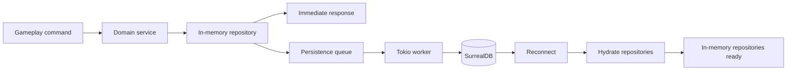
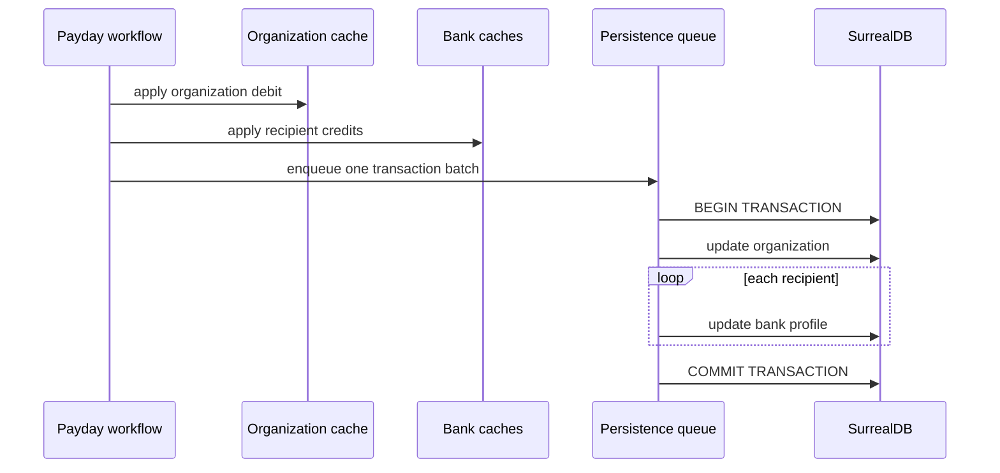

# Forge Server Persistence

SurrealDB persistence is disabled by default. Copy `config.example.toml` to `config.toml`, update the connection settings, and set `FORGE_SERVER_CONFIG` if the file should live outside the server working directory.

```powershell
$env:FORGE_SERVER_CONFIG="G:\forge\arma\crate\config.toml"
```

The extension keeps actor, bank, and organization repositories hot in memory and writes changes to SurrealDB on a background Tokio worker. Extension reads and writes do not wait on the database connection during gameplay.



`In-memory repositories ready` represents the same hot repository layer after a successful reconnect and hydration cycle.

Multi-record money movement is persisted as a SurrealDB transaction. Organization payday applies the organization debit and all recipient bank credits as a single queued batch, and the durable event backend records the corresponding domain event, audit record, and player notifications.



The database transaction prevents a persisted partial payday: the organization debit and every recipient credit commit together or the entire database batch fails. The hot caches are updated before the asynchronous write is processed, so persistence failures must remain observable through logs and database status metrics.

SurrealDB tables currently used by the extension:

- `actor`
- `audit_record`
- `bank`
- `domain_event`
- `garage`
- `locker`
- `notification`
- `organization`
- `organization_invite`
- `v_garage`
- `v_locker`

The worker uses a WebSocket connection, reconnects with bounded exponential backoff, and hydrates the in-memory cache after each successful connection. Use the extension commands `config_path` and `database_status` to inspect the active config path and persistence state.
