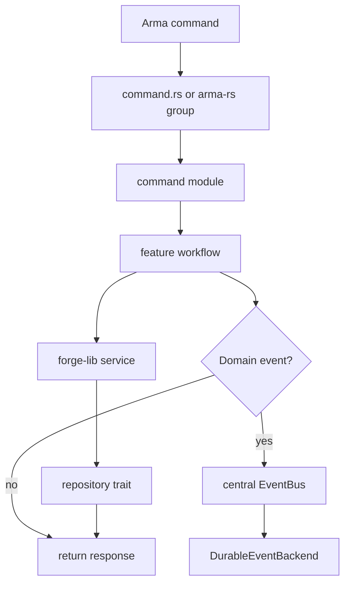
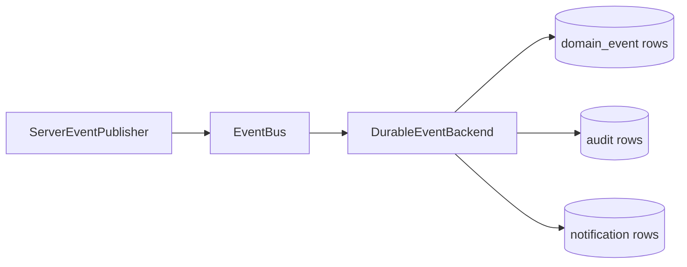
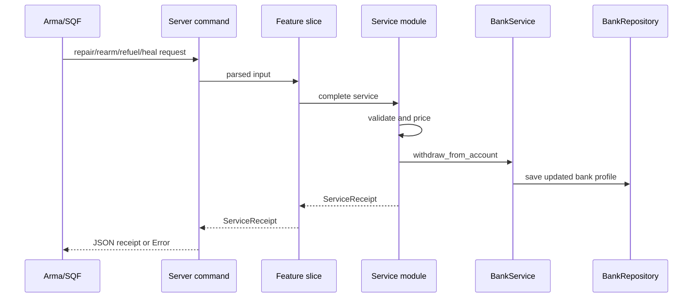

# Rust Server Architecture

Forge is a Rust workspace with two main crates:

- `forge-lib`: shared domain models, repository traits, services, events, and errors.
- `forge-server`: the Arma extension crate built as `forge_server_x64`, with command routing, runtime wiring, persistence, and server-specific feature workflows.

The server crate depends on `forge-lib`; `forge-lib` does not depend on the server.

## High-Level Flow

Most extension calls follow this path:



The command module should stay thin. It should parse command arguments, call the appropriate workflow, serialize the result, and log failures.

## Shared Library

`lib/src/models`

Domain data structures and serializable views live here. Examples:

- `actor.rs`: actor snapshots and actor state.
- `bank.rs`: money, bank profiles, accounts, and bank transactions.
- `organization.rs`: organizations, members, invites, payday plans, and transfer result models.
- `domain_event.rs`: the central `DomainEvent` enum.
- `actor_event.rs` and `organization_event.rs`: domain-specific event payloads.
- `notification.rs`: durable notification and audit record models.

`lib/src/repositories`

Repository traits define storage boundaries. In-memory implementations are used for tests and as hot caches in the server.

`lib/src/services`

Services hold domain behavior and validation. They know about repository traits, but they do not know about SurrealDB, Arma command routing, or the server event bus.

`lib/src/events`

The event system defines:

- `DomainEventHandler`: something that reacts to a `DomainEvent`.
- `EventBus`: dispatches events to handlers.
- `EventPublisher`: an interface used by feature workflows so they do not depend on a global bus directly.

## Server Crate

`arma/server/src/lib.rs`

Initializes logging, config, persistence, the central event bus, and arma-rs command groups.

`arma/server/src/command.rs`

String route dispatcher used by the transport layer.

`arma/server/src/events.rs`

Owns the server-level event bus:



This is the application event backbone. Feature workflows publish events through `EventPublisher`, and handlers react through the central bus.

`arma/server/src/features`

Feature slices live here:

```text
features/actor/
  init.rs
  lifecycle.rs
  query.rs
```

```text
features/bank/
  account.rs
  lifecycle.rs
```

```text
features/fuel/
features/rearm/
features/repair/
features/medical/
  mod.rs
```

```text
features/garage/
features/locker/
features/v_garage/
features/v_locker/
  lifecycle.rs
  query.rs
  storage.rs
```

```text
features/organization/
  create.rs
  invite.rs
  membership.rs
  payday.rs
  query.rs
  mod.rs
```

Each slice owns workflow orchestration for a related use case group.

`arma/server/src/persistence`

Persistence-specific code:

- `repository.rs`: cached repository implementations.
- `service.rs`: background persistence worker.
- `surreal.rs`: SurrealDB connection, hydration, and write application.
- `model.rs`: queued write operation types and metrics.
- `payday.rs`: transactional multi-record payday persistence.
- `durable_events.rs`: event handler that writes domain events, audit records, and notifications.

## Design Rules

- Keep core rules in `forge-lib` services.
- Keep server workflow orchestration in feature modules.
- Keep command modules thin.
- Use repository traits in services instead of direct persistence calls.
- Route player bank-account money movement through `BankService`.
- For paid gameplay services, calculate service rules in the service module and charge through `BankService`.
- Publish domain events through `EventPublisher`, not by directly calling persistence.
- Put SurrealDB-specific logic under `arma/server/src/persistence`.

## Paid Service Flow



## Vertical Slice Direction

The project is moving toward a hybrid vertical-slice structure:

- Shared domain models, services, repository traits, and errors remain in `forge-lib`.
- Server workflows move into `arma/server/src/features/<feature>/<slice>.rs`.
- Command modules expose the Arma surface and delegate to feature workflows.

This keeps shared business rules reusable while making feature work easier to locate.
