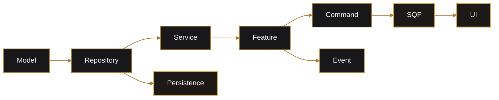

# Adding Features

This guide covers a complete feature from shared domain rules through Rust, SQF, persistence, and optional WebUI.

## Choose the Ownership Boundary

| Concern | Location |
| --- | --- |
| Domain entity, event, or view | `lib/src/models` |
| Storage interface | `lib/src/repositories` |
| Business rules | `lib/src/services` |
| Server use-case orchestration | `arma/crate/src/features/<domain>` |
| Extension command parsing | `arma/crate/src/<domain>.rs` |
| String transport route | `arma/crate/src/command.rs` |
| SurrealDB adapter | `arma/crate/src/persistence` |
| Arma engine/locality behavior | `arma/crate/addons/<domain>` |
| Browser presentation | `webui/src/features/<domain>` |

## End-to-End Flow



## 1. Model

- Add the smallest stable domain type.
- Use view models when serialized output should differ from stored data.
- Serialize money through `MoneyAmount`.
- Keep secrets private; expose booleans such as `pin_set`.
- Export public types from `models/mod.rs`.

## 2. Repository

- Define domain-required operations, not database queries.
- Update the in-memory implementation.
- Add focused repository/service tests.
- Implement the cached server adapter.

If persistent:

- add a static repository instance.
- add hydration.
- add the table.
- add cache-only hydration helpers.

## 3. Service

Services:

- validate.
- enforce permissions and invariants.
- mutate models.
- call repository traits.
- return typed results.

Services do not parse JSON, call SQF, or use SurrealDB directly.

## 4. Feature Slice

Create:

```text
arma/crate/src/features/<domain>/
```

Organize by use case, for example:

```text
lifecycle.rs
query.rs
storage.rs
transfer.rs
```

The feature composes services, event publishers, and application ports.

## 5. Domain Events

Publish an event when independent consumers need to react to a completed action.

Do not use an event when all records must commit atomically. Use a direct workflow plus `WriteOp::Batch`.

Add:

1. payload model.
2. `DomainEvent` variant.
3. stable name.
4. publisher call.
5. handlers.
6. durable mapping when needed.

## 6. Extension Commands

Add the command to:

- the arma-rs group.
- `command.rs` when chunked transport needs it.

Command functions should only:

- parse strings or JSON.
- invoke the feature.
- serialize views.
- log errors.

Update [Command Reference](command-reference.md).

## 7. SQF Addon

Follow the existing addon structure:

```text
addons/<domain>/
  config.cpp
  CfgEventHandlers.hpp
  script_component.hpp
  XEH_PREP.hpp
  XEH_preInit*.sqf
  XEH_postInit*.sqf
  functions/
```

Use CBA events for network and module coordination. Keep engine state capture in the owning addon.

## 8. WebUI

When needed:

1. add a component under `webui/src/features`.
2. use `requestFromArma`.
3. extend the SQF namespace router.
4. add an authoritative server handler.
5. return the standard response envelope.
6. include centered loading and error states.
7. avoid unguarded origin-dependent APIs such as `localStorage`.

## 9. Persistence

Use ordinary cached repository saves for one record.

Use a batch for:

- transfers.
- organization payday.
- any invariant spanning multiple persisted records.

Remember that cache mutation occurs before asynchronous durability.

## 10. Validation

```powershell
cargo fmt --check
cargo test --workspace
Set-Location webui
npm run build:arma
Set-Location ..\arma\crate
hemtt check
hemtt build
```

Then test a cold server start when the feature depends on hydrated data.

## Completion Checklist

- Ownership boundaries are clear.
- Domain rules have tests.
- Commands are documented.
- SQF functions have headers.
- CBA events have stable names and correlation where needed.
- New tables hydrate correctly.
- Multi-record writes are transactional.
- WebUI works under Arma's opaque browser origin.
- Docs and Mermaid diagrams match the implemented flow.
