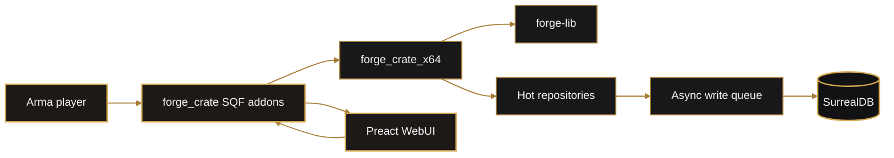
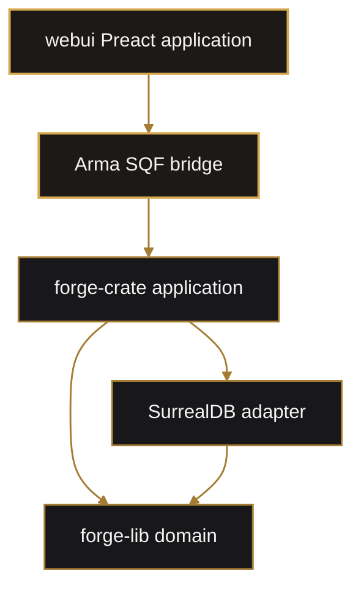
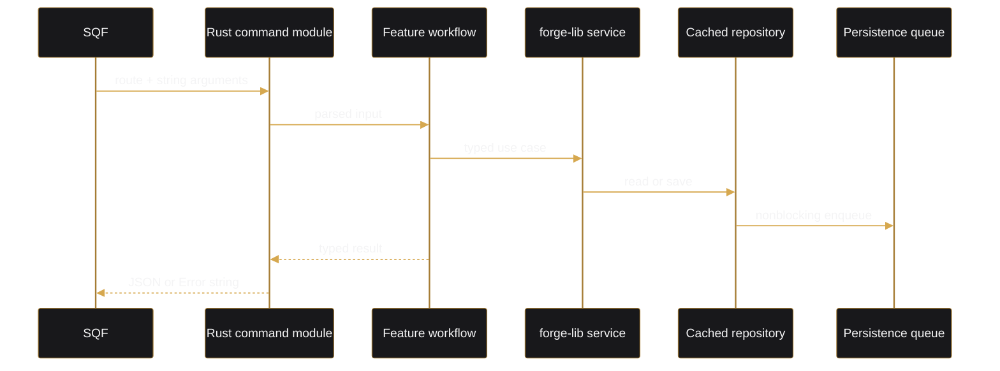
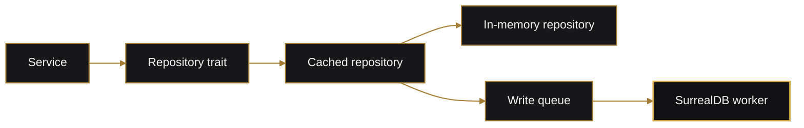
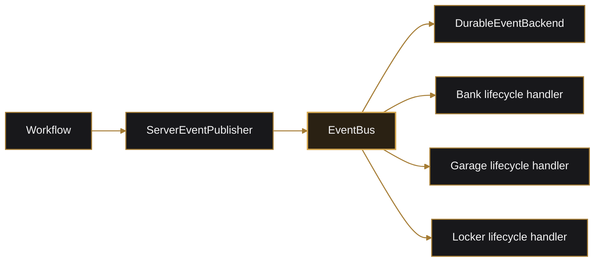
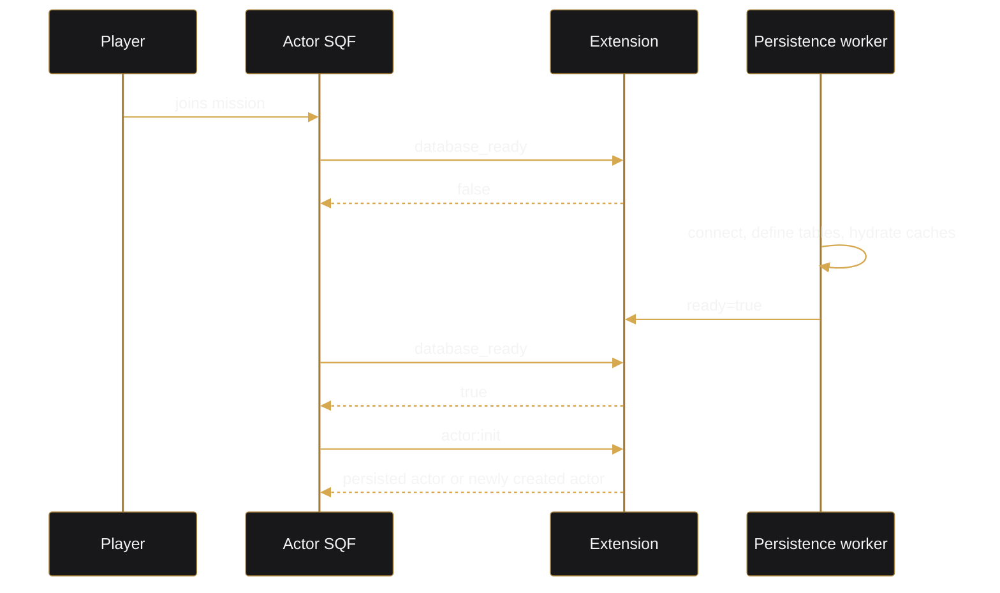
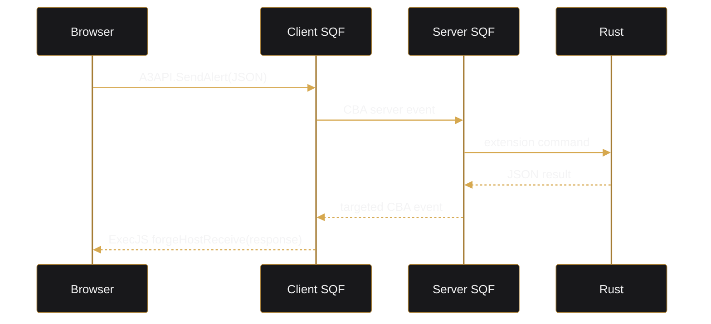

# Architecture

Forge uses a layered, event-driven architecture with vertical feature slices at the application boundary.

## System Context



The authoritative gameplay state lives in Rust repositories. SQF owns Arma-engine state and locality. The WebUI is a presentation client and never directly accesses the extension or database.

## Workspace Dependency Direction



`forge-lib` has no dependency on Arma, arma-rs, Tokio, or SurrealDB.

## Rust Layers

### Domain Library

Location:

```text
lib/src/
```

Responsibilities:

- `models`: entities, snapshots, views, events, receipts, and money types.
- `repositories`: storage interfaces plus in-memory implementations.
- `services`: validation and domain mutation.
- `events`: event bus, handler, and publisher interfaces.
- `shared`: domain errors and validation helpers.

Services may use repository traits. They must not know about:

- SQF command names.
- JSON response envelopes.
- SurrealDB.
- Tokio.
- global server event-bus instances.

### Application and Extension Layer

Location:

```text
arma/crate/src/
```

Responsibilities:

- `lib.rs`: extension initialization and arma-rs command groups.
- top-level domain modules such as `actor.rs` and `bank.rs`: parse command inputs, invoke workflows, serialize results.
- `command.rs`: string-route dispatch used by chunked transport.
- `features/<domain>`: vertical application workflows.
- `events.rs`: central server event bus and cross-domain event handlers.
- `persistence`: cached repositories and SurrealDB adapter.
- `transport.rs`: request staging and response chunking.
- `log.rs`: asynchronous aggregate and domain logging.

## Command Flow



The normal gameplay response does not wait for SurrealDB.

## Repository Pattern

Server repository implementations wrap shared in-memory repositories:



Special multi-record workflows use `WriteOp::Batch`, which is applied inside a SurrealDB transaction.

## Event Backbone

Feature workflows publish completed facts through `EventPublisher`.



The event bus is synchronous in memory. Handlers queue durable work rather than waiting for database I/O.

Current event-driven cross-domain use cases include:

- `ActorCreated` provisioning downstream profiles.
- `ActorDisconnected` cleanup for bank and storage domains.
- `LockerTransferCommitted` audit persistence.
- organization lifecycle audits and notifications.

## SQF Layer

Location:

```text
arma/crate/addons/
```

Each addon owns:

- `config.cpp` and `CfgEventHandlers.hpp`.
- `XEH_PREP.hpp` compiled function registration.
- `XEH_preInit*.sqf` event/settings registration.
- `XEH_postInit*.sqf` runtime startup.
- domain functions.

SQF coordination uses CBA events. A module owns its snapshot and persistence call; another module may request that action but should not construct or mutate the first module's payload.

Example: locker close requests an actor save and only commits the locker after receiving the correlated actor result.

## Actor Cold-Start Gate

Actor initialization must not query repositories before SurrealDB hydration completes.



The SQF poll uses CBA scheduling every 250 ms and does not block the game thread.

## WebUI Boundary

The Preact UI is loaded in `CT_WEBBROWSER`. Requests cross four boundaries:



See [WebUI and Browser Bridge](webui.md).

## Design Rules

- Keep command functions thin.
- Keep business rules in services.
- Keep Arma locality and engine operations in SQF.
- Keep workflow orchestration in feature slices.
- Keep persistence adapters out of the domain library.
- Publish events after successful mutation.
- Use transactions for multi-record money movement.
- Treat generated WebUI assets as build output.
- Keep persistent identifiers and money serialized in stable view models.
