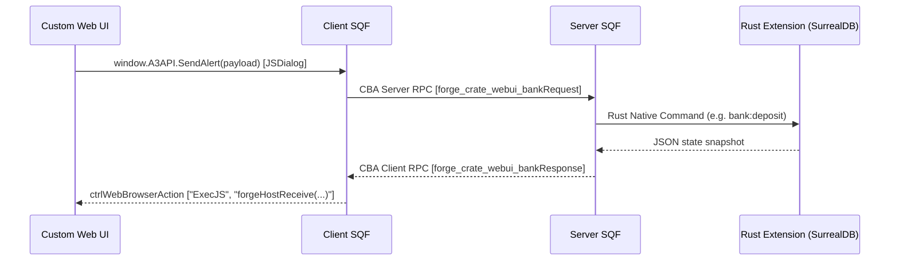

# Custom UI/UX Integration & Extensibility Developer Guide

One of the core design goals of the Forge framework is **extensibility**. Developers do not need to modify the core codebase or framework sources to customize the user interface or add new features. 

The framework uses an event-driven architecture that decouples the frontend UI representation, the client-side/server-side Arma (SQF) scripting layer, and the native Rust backend state. This document details how to build a custom UI, interface with the Arma browser control, and hook into framework events.

---

## 1. WebUI Architecture Overview

The Forge UI operates in a Chromium Embedded Framework (CEF) host provided by Arma 3's HTML browser control (`CT_WEBBROWSER`). 

### The Async Communication Loop

Since the UI runs inside the client browser control while the authoritative state lives on the server, all queries and transactions follow an asynchronous request/response pattern:



---

## 2. Custom UI & UX Integration

Developers can build a custom UI using any modern web technology (Preact, React, Vue, Svelte, or vanilla HTML/JS/CSS) and bundle it.

### Web-to-Arma Requests (JavaScript)
To query the game state or initiate transactions from your frontend, serialize your request as a JSON string and call `window.A3API.SendAlert`. 

Your payload should include:
- `requestId`: A unique identifier (e.g., timestamp + counter) to correlate the asynchronous response.
- `event`: The target action string (e.g., `bank::load`, `bank::deposit`).
- `data`: A key-value map containing the inputs for the action.

Here is a simplified wrapper matching the framework's core client bridge:

```typescript
type ForgeRequest = {
    requestId: string;
    event: string;
    data: Record<string, unknown>;
};

export function requestFromArma<T>(event: string, data: Record<string, unknown> = {}): Promise<T> {
    if (!window.A3API?.SendAlert) {
        return Promise.reject(new Error("Arma browser host bridge unavailable"));
    }

    const requestId = `${Date.now()}-${Math.random().toString(36).substr(2, 9)}`;
    const payload = JSON.stringify({ requestId, event, data });

    return new Promise<T>((resolve, reject) => {
        // Set a timeout to clear stale requests
        const timeout = window.setTimeout(() => {
            window.pendingRequests?.delete(requestId);
            reject(new Error(`Request ${event} timed out`));
        }, 10000);

        window.pendingRequests = window.pendingRequests || new Map();
        window.pendingRequests.set(requestId, { resolve, reject, timeout });

        window.A3API.SendAlert(payload);
    });
}
```

### Arma-to-Web Responses (JavaScript)
The client-side SQF routes all responses back to the browser control via `ctrlWebBrowserAction ["ExecJS", ...]`, calling the global function `window.forgeHostReceive`. Your UI must register this callback.

The response payload matches the following schema:
```typescript
type ForgeResponse<T = unknown> = {
    requestId: string; // Corresponds to the request (empty for server-pushed events)
    event: string;     // The event type name
    ok: boolean;       // Success flag
    data: T;           // Result data payload
    error: string;     // Error message if ok is false
};
```

Registering the receiver in your custom UI:

```javascript
window.forgeHostReceive = (response) => {
    // 1. Check if this is a correlated request/response
    if (response.requestId) {
        const pending = window.pendingRequests?.get(response.requestId);
        if (pending) {
            window.clearTimeout(pending.timeout);
            window.pendingRequests.delete(response.requestId);
            
            if (response.ok) {
                pending.resolve(response.data);
            } else {
                pending.reject(new Error(response.error));
            }
            return;
        }
    }

    // 2. Otherwise, treat it as a server-push event (e.g. balance updates)
    if (response.event) {
        document.dispatchEvent(new CustomEvent(response.event, { detail: response.data }));
    }
};
```

---

## 3. Replacing or Subclassing the Display

The default UI display is defined in `CfgDisplays` as `Forge_WebUI_Display` (IDD `78000`), housing browser control IDC `78001`.

To replace the prepackaged UI with your own build, you can override the display configuration or the entry point function without modifying the source code.

### Option A: Overriding the File Path (Vite/Dist)
The default display bootstrap script loads the compiled frontend files from `addons\webui\ui\_site\index.html`. You can replace this page by either:
1. Re-compiling your custom frontend bundle into the `webui/ui/_site/` folder during your build pipeline.
2. Creating an Arma mod that overrides the display class in `CfgDisplays` to load a custom `.html` page.

Example `config.cpp` override:
```sqf
class CfgDisplays {
    class Forge_WebUI_Display {
        class Controls {
            class Browser {
                // Subclass or override to load your own custom directory path
                // onLoad/onUnload events are inherited
            };
        };
    };
};
```

### Option B: Runtime Open Hook Override
Before opening the UI, client-side SQF publishes the CBA event `"forge_crate_bank_openRequested"`. The default handler calls `forge_crate_webui_fnc_open`.

You can intercept this call, prevent the default display from showing, and instantiate your own custom UI:

```sqf
// 1. Remove the default open handler
["forge_crate_bank_openRequested", "forge_crate_webui_fnc_open"] call CBA_fnc_removeEventHandler;

// 2. Register your own custom UI opener
["forge_crate_bank_openRequested", {
    params ["_args"];
    // Open your own display / browser control here
    createDialog "MyCustomWebUIDialog";
    // Load local html file or remote Vite development URL:
    ((findDisplay 12345) displayCtrl 6789) ctrlWebBrowserAction ["LoadFile", "x\my_addon\ui\index.html"];
}] call CBA_fnc_addEventHandler;
```

---

## 4. Hooking Into Client & Server Events

Forge uses **CBA Events** as its primary messaging layer. Developers can register event handlers to tap into banking, lifecycle, and organization operations.

### Key Event Names

Under the hood, events are generated via macro formatting. The fully resolved CBA event strings are:

| Event Name | Type | Description |
| :--- | :--- | :--- |
| `"forge_crate_bank_openRequested"` | Client | Dispatched to request the browser interface to open. |
| `"forge_crate_webui_bankRequest"` | Server RPC | Fired by client SQF when a browser makes a request. |
| `"forge_crate_webui_bankResponse"` | Client RPC | Fired by server SQF when returning results or pushing updates to a player's browser. |
| `"forge_crate_webui_refreshBank"` | Server RPC | Requests the server to fetch and push a fresh bank statement to a player client. |

### Intercepting Bank Requests on the Server
You can listen to incoming bank requests to add custom verification, deduct processing fees, or log audits.

```sqf
// Server-side script:
["forge_crate_webui_bankRequest", {
    params ["_player", "_requestId", "_event", "_data"];
    
    // Log player banking requests
    diag_log format ["[AUDIT] Player %1 (%2) requested: %3 with data: %4", 
        name _player, 
        getPlayerUID _player, 
        _event, 
        _data
    ];

    // Example intercept: block transfers over $50,000 if they don't have rank
    if (_event isEqualTo "bank::transfer") then {
        private _amount = _data getOrDefault ["amount", 0];
        if (_amount > 50000 && { rank _player != "COLONEL" }) then {
            // Build a rejection response
            private _errorResponse = createHashMapFromArray [
                ["requestId", _requestId],
                ["event", _event],
                ["ok", false],
                ["data", createHashMap],
                ["error", "Security alert: Transfers over $50,000 require Colonel rank."]
            ];
            // Send back to the client and abort further execution
            ["forge_crate_webui_bankResponse", [_errorResponse], _player] call CBA_fnc_targetEvent;
        };
    };
}] call CBA_fnc_addEventHandler;
```

### Intercepting Bank Responses on the Client
You can trigger sound effects, custom notification toasts, or UI updates in-game when the client receives responses:

```sqf
// Client-side script:
["forge_crate_webui_bankResponse", {
    params ["_response"];
    private _event = _response getOrDefault ["event", ""];
    private _ok = _response getOrDefault ["ok", false];

    if (_ok && { _event isEqualTo "bank::deposit" }) then {
        // Play ATM success beep locally
        playSound "ATM_Success_Beep";
    };
}] call CBA_fnc_addEventHandler;
```

## 5. Adding New Custom Events to the Bridge

You can extend the interface to support operations outside of banking (e.g., custom garages, item markets, lockboxes). 

### How Event Routing Works
The client-side event router `fnc_route.sqf` evaluates incoming events. Local client-side operations (like `"ui::close"`) are matched immediately at the beginning via a fast `exitWith` block. This bypasses any string allocation or array splitting for local UI calls. Other events fall through, are split by the `:` delimiter to extract their **namespace**, and are routed via a switch statement on `_namespace`:

```sqf
if (_event isEqualTo "ui::close") exitWith {
    private _display = ctrlParent _control;
    if !(isNull _display) then {
        _display closeDisplay 2;
    };
    true
};

private _parts = _event splitString ":";
private _namespace = if (count _parts > 0) then { _parts select 0 } else { "" };

switch (_namespace) do {
    case "bank": {
        private _requestId = _payload getOrDefault ["requestId", ""];
        private _data = _payload getOrDefault ["data", createHashMap];

        if (_requestId isNotEqualTo "" && { !isNull player }) then {
            [SRPC(webui,bankRequest), [player, _requestId, _event, _data]] call CFUNC(serverEvent);
        };
    };
    default {
        // Empty for the moment
    };
};
```

To implement a new feature (e.g., a weapon store market):

### Step 1: Send the Custom Action from JavaScript
Your custom UI issues a request containing your namespace prefix, such as `market::buy`:

```javascript
requestFromArma("market::buy", { itemId: "arifle_MX_F", price: 1200 })
    .then((result) => console.log("Purchase succeeded:", result))
    .catch((err) => console.error("Purchase failed:", err.message));
```

### Step 2: Add Your Namespace to `fnc_route.sqf`
Add a case matching your namespace to the switch statement, routing to your own server RPC (`marketRequest`):

```sqf
    case "market": {
        private _requestId = _payload getOrDefault ["requestId", ""];
        private _data = _payload getOrDefault ["data", createHashMap];

        if (_requestId isNotEqualTo "" && { !isNull player }) then {
            [SRPC(market,marketRequest), [player, _requestId, _event, _data]] call CFUNC(serverEvent);
        };
    };
```

### Step 3: Handle the Event on the Server
Listen to `"forge_crate_market_marketRequest"` (resolved from the `marketRequest` RPC) on the server, process the purchase logic, and deduct funds using the bank API:

```sqf
// Server-side custom addon init:
["forge_crate_market_marketRequest", {
    params ["_player", "_requestId", "_event", "_data"];
    
    switch (_event) do {
        case "market::buy": {
            private _itemId = _data getOrDefault ["itemId", ""];
            private _price = _data getOrDefault ["price", 99999];
            
            // 1. Process custom game logic (e.g., inventory space check and bank check)
            // Behind the scenes, my_mod_fnc_processPurchase calls the Rust extension
            // or bank commands to withdraw the price from the player's account.
            private _success = [_player, _itemId, _price] call my_mod_fnc_processPurchase;
            
            // 2. Prepare client response
            private _response = createHashMapFromArray [
                ["requestId", _requestId],
                ["event", _event],
                ["ok", _success],
                ["data", createHashMapFromArray [["itemId", _itemId], ["status", "delivered"]]],
                ["error", if (_success) then { "" } else { "Insufficient funds or inventory space." }]
            ];
            
            // 3. Dispatch response back to the player client (uses standard client event bridge)
            ["forge_crate_webui_bankResponse", [_response], _player] call CBA_fnc_targetEvent;
        };
    };
}] call CBA_fnc_addEventHandler;
```

---

## 6. Architectural Best Practices: Where to Put Domain Logic

You are completely correct to ask about keeping domain logic in its proper place. In the Forge framework, developers have two patterns to choose from when implementing a custom feature:

### Pattern A: Rust-Authoritative (Recommended)
To keep domain-specific logic completely self-contained and ensure database transactional safety (preventing exploits/dupes), the business rules should reside in the **Rust Extension** (`forge-lib` and `forge-crate`).

1. **SQF Layer (Transport Only)**: Intercepts the player's UI request, packages it, and immediately forwards it to the native extension:
   ```sqf
   private _result = ["market:buy", [_uid, _itemId, _price]] call EFUNC(extension,call);
   ```
2. **Rust Domain Layer**: The native Rust `market` feature slice validates the transaction (checking configuration price lists, limits, or player database state).
3. **Cross-Domain Interaction**: Inside Rust, the market service calls `BankService::withdraw_from_account` directly. This debit operation and the database updates are queued/batched in a single secure operation, ensuring **atomicity** (the player cannot get the item if the bank database update fails).
4. **Domain Event Bus**: The native Rust `EventBus` registers the successful sale, publishing a `market.item_purchased` event which writes audit logs and notification rows in SurrealDB.

> [!TIP]
> This pattern is highly recommended for complex, server-authoritative components (like persistent garages or virtual lockboxes) to guarantee that item delivery and payment remain transactional and cheat-proof.

### Pattern B: SQF-Delegated (For Scripting-Only Addons)
If you want to build a lightweight addon using SQF scripts without compiling or modifying the Rust extension, you can handle the gameplay validation in SQF and call the banking commands as a service:

1. **SQF Domain Validation**: Your script handles shop checks (e.g., checking if the player is near a physical shop object, checking vehicle slots, or checking physical inventory space).
2. **Deducting Funds**: You call the native bank command to withdraw the money:
   ```sqf
   (["bank:withdraw", [_uid, _price]] call EFUNC(extension,call)) params ["_result", "_success"];
   ```
3. **State Sync**: If the extension returns `_success`, you spawn/give the item to the player.

---

## 7. Extension Event Bus & CBA Hooking

The native Rust extension has a central, compiled `EventBus` that fires when domain actions occur (e.g., `actor.created`, `actor.disconnected`, `organization.payday_issued`).

These events publish durably to SurrealDB and are also dispatched back to the SQF host via the main extension callback bridge (`ExtensionCallback`). The main bridge automatically translates them into **CBA Local Events** on the server using the naming structure:

```text
forge_crate_<feature>_<callback>
```

For example, when an organization payday completes:
1. Rust publishes `DomainEvent::OrganizationPaydayIssued`.
2. The event is pushed to SQF via the callback bridge.
3. SQF raises the CBA local event `"forge_crate_organization_payday_issued"` on the server.
4. Any custom developer addon can listen to this event to spawn notifications, play server-wide announcements, or log custom statistics:

```sqf
// In your custom server addon:
["forge_crate_organization_payday_issued", {
    params ["_eventPayload"];
    private _orgName = _eventPayload getOrDefault ["name", ""];
    private _amount = _eventPayload getOrDefault ["amount", 0];
    
    // Custom action: play server-wide sound when payday drops
    [format ["Payday of $%1 has been distributed to %2!", _amount, _orgName]] remoteExec ["systemChat", 0];
}] call CBA_fnc_addEventHandler;
```


