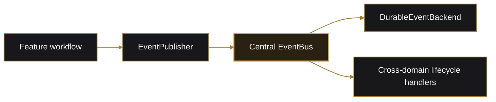
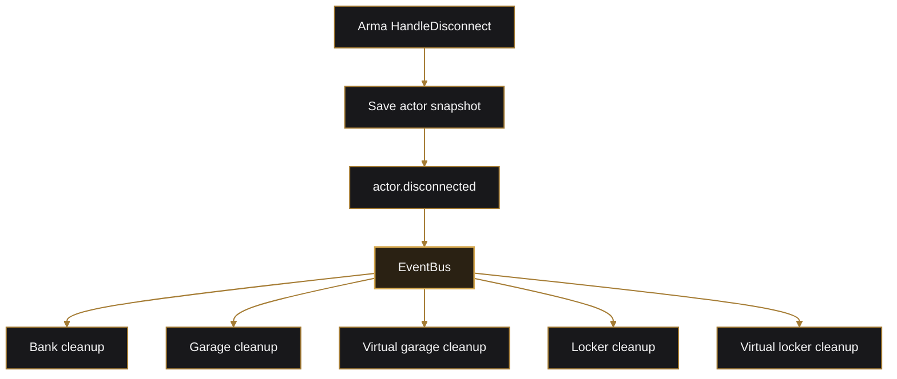
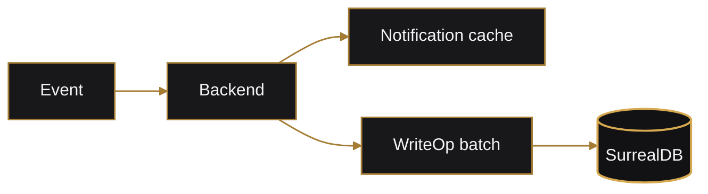

# Events, Audit, and Notifications

Forge has two related event systems:

- Rust domain events for server/application reactions.
- CBA events for SQF coordination and network RPC.

They solve different problems and are not interchangeable.

## Rust Domain Events

Shared interfaces:

```text
lib/src/events/
```

- `EventPublisher`
- `EventBus`
- `DomainEventHandler`

Server wiring:

```text
arma/crate/src/events.rs
```



Events describe completed facts. Validation and mutation happen before publication.

## Current Domain Events

| Event name | Purpose |
| --- | --- |
| `actor.created` | New actor was created with starting configuration. |
| `actor.disconnected` | Actor snapshot was saved during disconnect. |
| `locker.transfer_committed` | Locker transfer completed after actor persistence succeeded. |
| `organization.created` | Player organization was created. |
| `organization.disbanded` | Player organization was disbanded and members reassigned. |
| `organization.invite_created` | Invite was created. |
| `organization.invite_accepted` | Invite was accepted. |
| `organization.invite_declined` | Invite was declined. |
| `organization.member_left` | Member left for the default organization. |
| `organization.member_kicked` | Member was kicked to the default organization. |
| `organization.payday_issued` | Organization payday completed. |

## Actor Lifecycle Fan-Out



Handlers are independent. One failure is logged and does not prevent later handlers from running.

## Durable Backend

Location:

```text
arma/crate/src/persistence/durable_events.rs
```

The handler serializes events and conditionally creates audits and notifications.



## Notification Surface

Extension commands:

- `notification:list`
- `notification:unread`
- `notification:mark_read`
- `notification:mark_all_read`

SQF wrappers:

- `forge_crate_notification_fnc_list`
- `forge_crate_notification_fnc_unread`
- `forge_crate_notification_fnc_markRead`
- `forge_crate_notification_fnc_markAllRead`
- `forge_crate_notification_fnc_deliver`

Current join-time delivery uses `systemChat`, then marks displayed notifications read.

## CBA Events

CBA events coordinate SQF modules and network boundaries.

Examples:

- bank terminal publishes `forge_crate_bank_openRequested`.
- WebUI sends `forge_crate_webui_bankRequest` to the server.
- server targets `forge_crate_webui_response` back to one client.
- locker requests `forge_crate_actor_saveRequested` and correlates the result.

These names are generated by addon macros; see [SQF Addons](sqf-addons.md).

## Native Extension Callbacks

One raw callback handler is registered by the `main` addon.

Rust callback namespaces beginning with `forge:` are converted into CBA events:

```text
forge:<feature> + <function>
    -> forge_crate_<feature>_<function>
```

Feature addons should subscribe to the routed CBA event.

## Adding a Domain Event

1. Add the payload to a domain-specific event model.
2. Add the `DomainEvent` variant.
3. Add the stable event name.
4. Export the payload.
5. Publish from the feature workflow after success.
6. Add event handlers for cross-cutting reactions.
7. Add durable audit/notification mapping when required.
8. Test the event name and handler behavior.

## Event Rules

- Events are past tense facts, not permission requests.
- Core rules stay in services.
- Event handlers should be idempotent where practical.
- Do not hide required transactional work behind eventually consistent events.
- Use CBA correlation IDs when SQF workflows require ordered confirmation.
