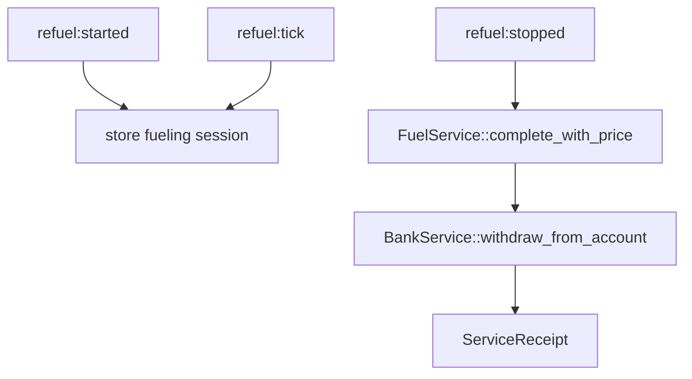
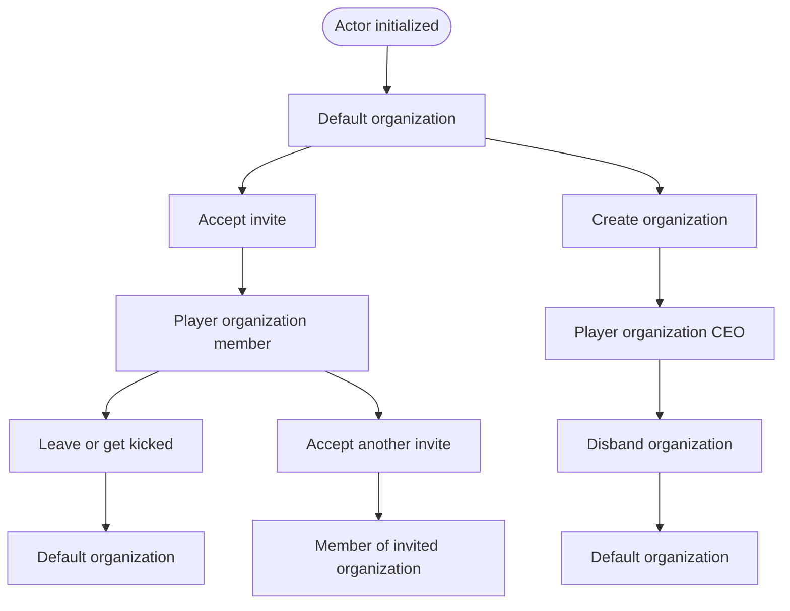
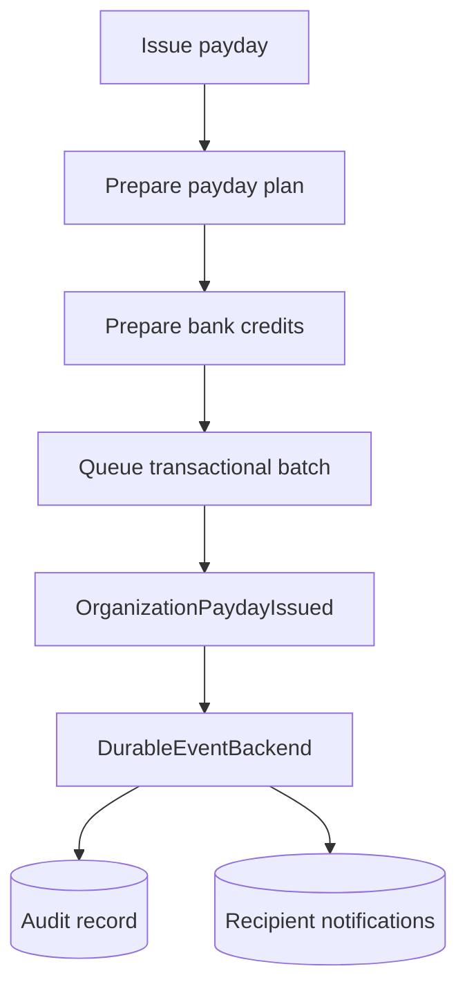

# Feature Guide

This page summarizes the current Rust server features and the main files involved.

## Actor

Main files:

- `lib/src/models/actor.rs`
- `lib/src/services/actor.rs`
- `arma/crate/src/actor.rs`
- `arma/crate/src/features/actor/*`

Actor init accepts an `ActorSnapshot` and returns an actor plus a `created` flag. If the actor is new, `ActorService::init_or_create` persists the mission-configured default loadout and returns an `ActorCreated` domain event. The actor feature publishes that event through the central event bus. SQF strips the local player before applying this default loadout.

If an actor already exists, initialization treats the persisted actor as authoritative and does not save the temporary spawn snapshot over it. Client SQF restores the persisted loadout, ASL position, direction, rank, and stance. If position restoration leaves the player more than five meters above local ground while descending, SQF clears their velocity and moves them to a safe one-meter ATL position. Life-state metadata remains available to respawn and medical workflows rather than forcing a returning player dead or inventing an injury severity.

Actor disconnect persists the live player snapshot and publishes `ActorDisconnected`. Bank, garage, locker, and virtual-storage cleanup then fan out through the central event bus.

Client synchronization uses a small `createHashMap` state machine rather than a second repository. Its active path is `UNINITIALIZED` to `LOADING` to `APPLYING` to `READY`, with `FAILED` as the error state and retry source. All transitions go through the actor `transition` function, which rejects invalid changes, publishes `forge_crate_actor_lifecycleStateChanged`, and updates the player readiness variables. Server-side initialization guards prevent duplicate requests from racing multiple actor responses.

Actor CBA settings control position and loadout persistence independently. Both default to enabled and are globally synchronized. Disabling either setting stops restore and prevents disconnect snapshots from replacing the last persisted value. With loadout persistence disabled, the configured mission loadout is applied on every login.

Actor server workflows are organized as vertical slices:

- `init.rs`: init or create actor.
- `lifecycle.rs`: disconnect and delete actor.
- `query.rs`: get actor by uid.

Current commands:

- `actor:init`
- `actor:disconnect`
- `actor:get`
- `actor:delete`

## Bank

Main files:

- `lib/src/models/bank.rs`
- `lib/src/services/bank.rs`
- `lib/src/repositories/bank.rs`
- `arma/crate/src/bank.rs`
- `arma/crate/src/features/bank/*`
- `arma/crate/src/persistence/payday.rs`

Bank profiles hold player cash, account balances, pending earnings, a salted ATM PIN hash, and up to ten recent ledger entries. Player bank-account reads and money movement go through `BankService`. Player transfers persist the sender debit and recipient credit in one queued transaction batch. Organization payday applies the organization debit and recipient bank credits the same way, with recipient credits prepared through `BankService` before persistence batches the writes.

The bank WebUI uses a server-authoritative request/response bridge. Browser requests travel through `JSDialog` to SQF, are forwarded to the server, and call the Rust extension using the requesting player's UID. The resulting bank snapshot is returned to that player's browser with `ctrlWebBrowserAction ["ExecJS", ...]`. The UI does not update balances optimistically.

Bank server workflows are organized as:

- `account.rs`: initialize, read, deposit, withdraw, and transfer player bank funds.

Bank disconnect cleanup is an internal `ActorDisconnected` event handler rather than a public extension command.

Current commands:

- `bank:init`
- `bank:get`
- `bank:deposit`
- `bank:withdraw`
- `bank:transfer`
- `bank:add_earnings`
- `bank:submit_earnings`
- `bank:change_pin`

## Garage and Locker

Main files:

- `lib/src/models/garage.rs`
- `lib/src/models/locker.rs`
- `lib/src/models/v_garage.rs`
- `lib/src/models/v_locker.rs`
- `lib/src/services/garage.rs`
- `lib/src/services/locker.rs`
- `lib/src/services/v_garage.rs`
- `lib/src/services/v_locker.rs`
- `arma/crate/src/garage.rs`
- `arma/crate/src/locker.rs`
- `arma/crate/src/v_garage.rs`
- `arma/crate/src/v_locker.rs`
- `arma/crate/src/features/garage/*`
- `arma/crate/src/features/locker/*`
- `arma/crate/src/features/v_garage/*`
- `arma/crate/src/features/v_locker/*`

Physical garage/locker data and virtual unlock collections are separate models and repositories.

Physical locker access points are Eden-placed containers or objects with variable names `locker`, `locker_1`, `locker_2`, and so on. The locker addon discovers names through `locker_999` and adds an `Open Locker` action to each valid object. The placed object is only an access terminal, so the server clears and locks its ordinary shared cargo. Persisted player cargo is materialized in a hidden, server-created networked inventory proxy unique to that request, captured when the inventory closes, and saved through `locker:save` before the server deletes the proxy. Networked proxies are required because Arma does not support backpacks inside local-only containers during multiplayer. Multiple players can still use the same terminal concurrently because each request receives a separate proxy.

Closing a locker publishes a correlated CBA actor-save request. The actor addon captures and persists its own post-transfer loadout through `actor:save`; only its success response allows the locker addon to normalize and persist its own proxy through `locker:commit`. This fail-closed ordering prevents the locker from accepting deposited equipment while the persisted actor still owns it. If actor persistence fails, the proxy remains available but is not reopened automatically. The player must explicitly use `Open Locker` again to retry, preventing recursive inventory-close loops. On disconnect, the actor addon's successful disconnect save emits a server-local event that allows locker persistence; failed actor persistence discards the temporary proxy without updating the locker.

Locker persistence normalizes equipment into a classname-keyed commodity map. Weapon attachments are detached, loaded primary and secondary muzzle magazines become magazine entries, and nested container contents are recursively flattened. Uniforms, vests, and backpacks therefore return empty, with their former contents available as loose locker cargo. Every commodity record includes an `ammo` field, which is zero for non-magazine entries. Magazine entries retain both object quantity and aggregate remaining ammunition; restoration redistributes those rounds into full magazines followed by a partial magazine.

The Virtual Garage and Virtual Locker addons each expose two globally synchronized CBA settings, all enabled by default. The feature setting controls whether the virtual garage or arsenal is available at all. The persistence setting independently controls whether player unlocks are loaded and saved through Rust; when persistence is disabled, mission defaults and organization unlocks remain available for the current session. A disabled virtual module skips its profile and client snapshot without interrupting the physical garage/locker initialization chain.

Virtual Locker uses ACE Arsenal and adds `Open Virtual Arsenal` to the same Eden `locker*` terminals as physical storage. The client rebuilds a hidden local ACE Arsenal box whenever its merged unlock snapshot arrives. Closing this Forge-owned arsenal publishes the existing correlated actor-save request so the actor addon persists the resulting loadout through its own domain workflow. Opening the arsenal does not modify or save unlock records; unlock persistence remains owned by `v_locker` workflows.

These server workflows use the same slice names:

- `lifecycle.rs`: initialize and delete records.
- `query.rs`: get records by player uid.
- `storage.rs`: save full records.

Current command groups:

- `garage:*`
- `locker:*`
- `v_garage:*`
- `v_locker:*`

Disconnect cleanup is internal to the `ActorDisconnected` event handlers and is not exposed as feature commands.

## Refuel

Main files:

- `lib/src/models/fuel.rs`
- `lib/src/models/service.rs`
- `lib/src/models/transaction.rs`
- `lib/src/services/refuel.rs`
- `arma/crate/src/refuel.rs`
- `arma/crate/src/features/refuel/*`

Refuel supports session-based refueling from Arma events and direct refuel completion commands. Completed refuels charge the player bank account through `BankService` and return a `ServiceReceipt`. Refuel prices are read from `CfgMission >> Services >> Refuel`, with Rust defaults used by the domain service if a caller does not provide custom pricing.

Current commands:

- `refuel:started`
- `refuel:tick`
- `refuel:stopped`
- `refuel:price`
- `refuel:quote`
- `refuel:complete`

## Gameplay Services

Main files:

- `lib/src/models/service.rs`
- `lib/src/services/repair.rs`
- `lib/src/services/rearm.rs`
- `lib/src/services/medical.rs`
- `arma/crate/src/repair.rs`
- `arma/crate/src/rearm.rs`
- `arma/crate/src/medical.rs`
- `arma/crate/src/features/repair/*`
- `arma/crate/src/features/rearm/*`
- `arma/crate/src/features/medical/*`

Repair, rearm, refuel, and medical services are service-style workflows. They validate the requested work, calculate a quote, charge the player bank account through `BankService` when the configured fee is greater than zero, and return a consistent `ServiceReceipt`.

Mission-config pricing:

- `CfgMission >> Services >> Refuel >> regularPricePerLiter`
- `CfgMission >> Services >> Refuel >> jeta1PricePerLiter`
- `CfgMission >> Services >> Repair >> fullRepairPrice`
- `CfgMission >> Services >> Rearm >> unitPrice`
- `CfgMission >> Services >> Medical >> respawnPrice`
- `CfgMission >> Services >> Medical >> fullHealPrice`

If a configured value is `0.00`, the service completes without a bank withdrawal. Rust services keep internal defaults so direct callers still have a deterministic fallback.

Current commands:

- `repair:quote`
- `repair:complete`
- `rearm:quote`
- `rearm:complete`
- `medical:respawn`
- `medical:heal`

## Organization

Main files:

- `lib/src/models/organization.rs`
- `lib/src/models/organization_event.rs`
- `lib/src/services/organization.rs`
- `lib/src/repositories/organization.rs`
- `arma/crate/src/organization.rs`
- `arma/crate/src/features/organization/*`

Organization server workflows are organized as vertical slices:

- `create.rs`: create default org, create player org, disband player org.
- `invite.rs`: create, accept, and decline invites.
- `membership.rs`: leave org, kick member, add member.
- `payday.rs`: issue payday.
- `query.rs`: get organization by id or member uid.

### Organization Rules

- The default organization is the fallback organization.
- Players cannot directly leave the default organization.
- Players cannot be kicked from the default organization.
- A player leaves the default organization only by accepting an invite or creating their own player organization.
- A player can belong to one organization at a time.
- Creating a player organization moves the new CEO out of their previous organization.
- Accepting an invite moves the player out of their previous organization before adding them to the invited organization.
- A player organization has one CEO.
- The CEO cannot leave a player organization. The CEO must disband it.
- Disbanding a player organization moves all former members, including the CEO, into the default organization as regular members.
- Members can leave a player organization and are moved to the default organization.
- CEOs can kick non-CEO members from a player organization, and kicked members are moved to the default organization.

The two terminal default-organization nodes represent the same fallback organization. They are shown separately to keep each lifecycle path readable. The CEO has no direct leave transition. Disbanding is the only path from player-organization CEO back to the default organization, and it moves every member with them.

### Organization Payday

Payday is split into two phases:

1. `OrganizationService::prepare_payday` validates permissions, recipients, amount, and organization balance.
2. `BankService::prepare_deposits` prepares recipient bank credits.
3. `persistence::apply_payday_plan` applies the organization debit and all recipient bank credits as a queued transaction batch.

After the money movement is applied in memory and queued for persistence, the server publishes `OrganizationPaydayIssued`. The durable event backend records the event, an audit row, and recipient notifications.

Current commands:

- `organization:create_default`
- `organization:create_player`
- `organization:disband`
- `organization:create_invite`
- `organization:accept_invite`
- `organization:decline_invite`
- `organization:leave_member`
- `organization:kick_member`
- `organization:add_member`
- `organization:get`
- `organization:get_by_member`
- `organization:issue_payday`

## Persistence Status and Transport

Main files:

- `arma/crate/src/config.rs`

Current commands:

- `organization:create_default`
- `organization:create_player`
- `organization:disband`
- `organization:create_invite`
- `organization:accept_invite`
- `organization:decline_invite`
- `organization:leave_member`
- `organization:kick_member`
- `organization:add_member`
- `organization:get`
- `organization:get_by_member`
- `organization:issue_payday`

## Persistence Status and Transport

Main files:

- `arma/crate/src/config.rs`
- `arma/crate/src/transport.rs`
- `arma/crate/src/persistence/*`

Useful commands:

- `database_status`
- `config_path`
- `log_path`
- `transport:*`

## Commander

Main files:

- `arma/crate/addons/commander/config.cpp`
- `arma/crate/addons/commander/CfgCommander.hpp`
- `arma/crate/addons/commander/functions/fnc_create.sqf`
- `arma/crate/addons/commander/functions/fnc_reassign.sqf`
- `arma/crate/addons/commander/functions/fnc_objectives.sqf`
- `arma/crate/addons/commander/functions/fnc_enemySide.sqf`

The Commander module is an advanced dynamic AI system that manages AI asset spawning, objective prioritization, threat assessment, and sector patrols. It implements a performance-optimized virtualization state machine to keep server CPU overhead low in multiplayer environments.

### 1. Threat Assessment & Objective Selection

- **Threat Calculation (`computeThreat`)**: Monitors players' 2D distance to objectives and player density on the server, generating a dynamic threat level between `0.0` (peaceful) and `1.0` (high threat).
- **Objective Prioritization (`updateObjectivePriority`)**: Assigns dynamic priority values to objectives based on player proximity.
- **Strategic Selection (`selectObjective`)**: Targets the highest-priority active sector to route offensive assets. Fallback positions automatically scan `allMapMarkers` starting with `"obj_"` and check `surfaceIsWater` to prevent objective placement in water.

### 2. Multi-State Virtualization Pipeline

To conserve server CPU cycles, AI groups are not immediately materialized as active units. Instead, they transition through an optimized lifecycle:

- **State A: Fully Virtualized (En Route)**: Groups exist only as lightweight data structures (HashMaps) storing type, side, size, spawn position, destination, creation time, and travel speed. Their map coordinate is mathematically interpolated over time as they "march" towards the objective via `interpolateGroupPos`.
- **State B: Leader-Only Patrol (At Sector, players > 2000m)**: When a virtual infantry or support group reaches its target sector, it spawns *only the team leader* (group size 1). The leader immediately initiates a random CBA patrol around the sector, providing organic presence with minimal performance cost.
- **State C: Fully Materialized (Players within 2000m)**: If a player enters the 2000m virtualization boundary of the group's current position (either en route or at the sector), the full squad (and support vehicles) is spawned/reinforced around the leader in formation, preserving the squad's configured size.
- **Hysteresis & Dematerialization**: If players retreat beyond 2500m, active squads are stripped back down to leader-only status (if at a sector) or dematerialized fully back to virtual data (if still en route), avoiding rapid spawn/despawn cycles at boundary margins.
- **Armor Group Exclusion**: Armor groups are excluded from leader-only spawning (always spawning crew + vehicle together when players approach) to maintain vehicle simulation integrity.

### 3. Sector Defenses and Patrols

- Active groups arriving within 200m of their target objective automatically transition into defensive patrol patterns.
- Waypoints are cleared and managed using CBA patrol tasks with configured, type-specific radii:
  - **Infantry**: 200m patrol radius.
  - **Support**: 300m patrol radius.
  - **Armor**: 400m patrol radius.

### 4. API & Lifecycle Methods

All API calls are invoked as hashMap methods on the global commander instance (`forge_commander_service`):

- **`start`**: Begins loops for threat calculations, target prioritization, spawner management, virtualization, and group maintenance.
- **`stop`**: Pauses all loops. Spawned AI groups remain alive on the map but the commander stops managing them or spawning new ones.
- **`destroy`**: Pauses loops, deletes all managed groups and vehicles safely from the simulation, and resets the commander's state.
