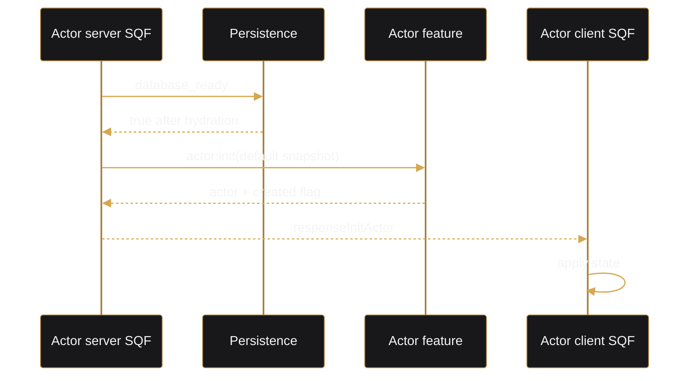
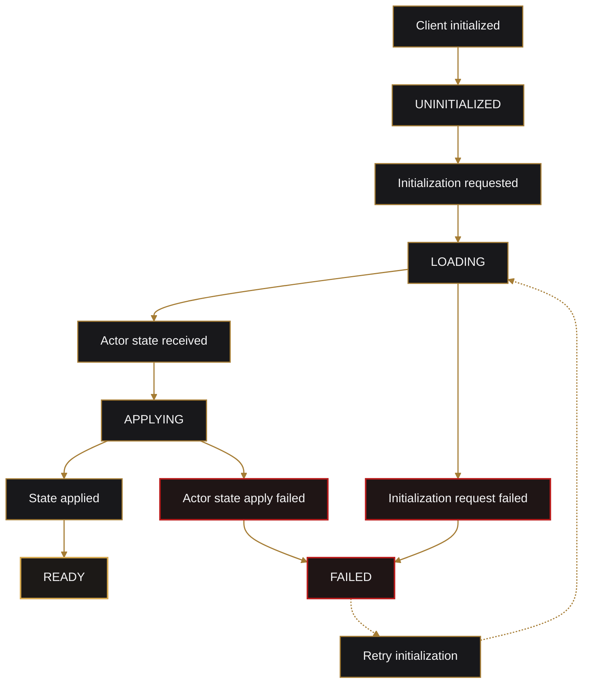

# Actor Feature

## Ownership

Main files:

- `lib/src/models/actor.rs`
- `lib/src/services/actor.rs`
- `arma/crate/src/actor.rs`
- `arma/crate/src/features/actor/`
- `arma/crate/addons/actor/`

## Initialization

The readiness gate is critical on cold server starts. Initialization waits until existing actors have been hydrated into the cache.

New actor:

- mission default loadout is captured into the creation snapshot.
- Rust creates and saves the actor.
- `ActorCreated` is published.
- client SQF strips the unit and applies the configured loadout.

Existing actor:

- the persisted actor is authoritative.
- the temporary spawn snapshot does not overwrite it.
- loadout, position, direction, rank, and stance are restored according to settings.

## Client Lifecycle

The lifecycle hashmap tracks synchronization only. Actor data remains in Rust repositories.

## Position Safety

After ASL restore:

- if the actor is more than five meters above local ATL ground.
- and vertical velocity is negative.
- velocity is cleared.
- the actor is moved to one meter ATL.

This prevents a restored airborne position from immediately causing fall damage.

## Persistence Settings

- `forge_crate_actor_persistPosition`
- `forge_crate_actor_persistLoadout`

Both default to enabled.

With loadout persistence disabled, the mission default loadout is applied on every initialization and live snapshots do not replace the persisted loadout.

## Save and Disconnect

`actor:save` persists a live snapshot without publishing disconnect.

`actor:disconnect`:

1. captures the live snapshot.
2. preserves fields disabled by CBA persistence settings.
3. saves the actor.
4. publishes `ActorDisconnected`.
5. lets bank and storage handlers clean up through the Rust event bus.

## Commands

- `actor:init`
- `actor:save`
- `actor:disconnect`
- `actor:get`
- `actor:delete`
