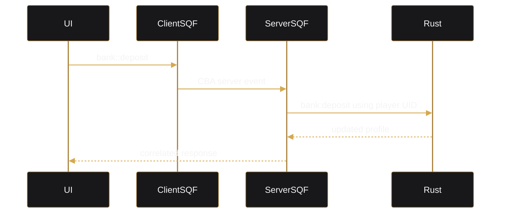

# Bank Feature

## Ownership

- `lib/src/models/bank.rs`
- `lib/src/services/bank.rs`
- `lib/src/repositories/bank.rs`
- `arma/crate/src/bank.rs`
- `arma/crate/src/features/bank/`
- `arma/crate/addons/bank/`
- `arma/crate/addons/webui/`
- `webui/src/features/bank/`

## Profile Model

A player bank profile contains:

- UID.
- cash carried by the player.
- account UUID and account balance.
- pending earnings.
- salted ATM PIN hash.
- up to ten recent transactions.

Public views serialize money as decimal strings and expose only `pin_set`, never the PIN hash.

## Money Movement

- deposit moves cash into the bank account.
- withdrawal moves account funds into cash.
- transfer debits one profile and credits another.
- pending earnings are accumulated separately and explicitly submitted to the account.
- service fees and organization payday credits also use `BankService`.

Multi-profile saves use queued batches.

## WebUI

The UI is server-authoritative:

The UI does not optimistically modify balances.

## Access Terminals

Objects named `bank` or `bank_1` through `bank_999` receive `Open Bank`. The bank addon publishes a local open request; the WebUI addon owns display creation.

## Organization Snapshot

The bank UI may display:

- organization name.
- player role (`CEO` or `Member`).
- organization funds.

These values are read-only in the player bank UI.

## Digital Card

The final four displayed digits use:

1. numeric characters from the bank account UUID.
2. player UID digits.
3. `0000`.

## Commands

- `bank:init`
- `bank:get`
- `bank:deposit`
- `bank:withdraw`
- `bank:transfer`
- `bank:add_earnings`
- `bank:submit_earnings`
- `bank:change_pin`
