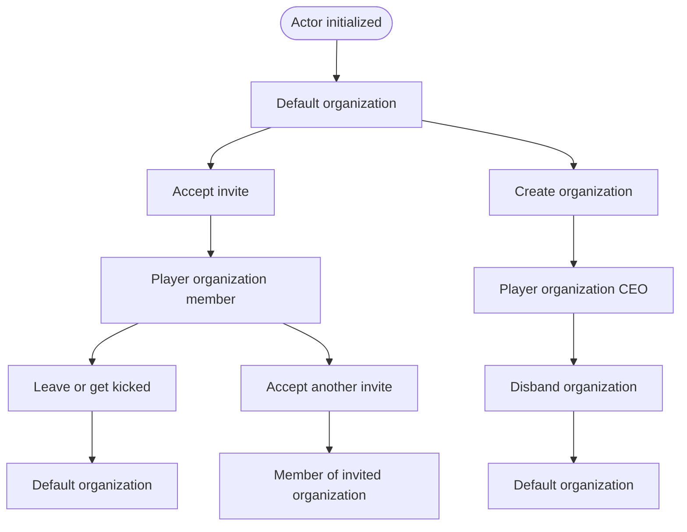
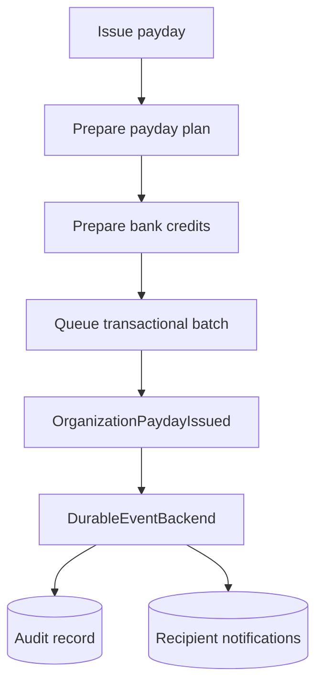

# Organization Feature

Main files:
- `lib/src/models/organization.rs`
- `lib/src/models/organization_event.rs`
- `lib/src/services/organization.rs`
- `lib/src/repositories/organization.rs`
- `arma/crate/src/organization.rs`
- `arma/crate/src/features/organization/*`

## Mechanics

### Organization Rules
- The default organization is the fallback organization.
- Players cannot directly leave the default organization.
- Players cannot be kicked from the default organization.
- A player leaves the default organization only by accepting an invite or creating their own player organization.
- A player can only belong to one organization at a time.
- Creating a player organization moves the new CEO out of their previous organization.
- Accepting an invite moves the player out of their previous organization before adding them to the invited organization.
- A player organization has one CEO.
- The CEO cannot leave a player organization. The CEO must disband it.
- Disbanding a player organization moves all former members, including the CEO, into the default organization as regular members.
- Members can leave a player organization and are moved to the default organization.
- CEOs can kick non-CEO members from a player organization, and kicked members are moved to the default organization.

The two terminal default-organization nodes represent the same fallback organization. They are shown separately to keep each lifecycle path readable. The CEO has no direct leave transition. Disbanding is the only path from player-organization CEO back to the default organization, and it moves every member with them.

### Organization Payday
Payday is split into three steps:
1. `OrganizationService::prepare_payday` validates permissions, recipients, amount, and organization balance.
2. `BankService::prepare_deposits` prepares recipient bank credits.
3. `persistence::apply_payday_plan` applies the organization debit and all recipient bank credits as a queued transaction batch.

After the money movement is applied in memory and queued for persistence, the server publishes `OrganizationPaydayIssued`. The durable event backend records the event, an audit row, and recipient notifications.

## Code Organization (Vertical Slices)
Organization server workflows are organized as vertical slices:
- `create.rs`: Create default org, create player org, disband player org.
- `invite.rs`: Create, accept, and decline invites.
- `membership.rs`: Leave org, kick member, add member.
- `payday.rs`: Issue payday.
- `query.rs`: Get organization by ID or member UID.

## Current Commands
- `organization:create_default`
- `organization:create_player`
- `organization:disband`
- `organization:create_invite`
- `organization:accept_invite`
- `organization:decline_invite`
- `organization:leave_member`
- `organization:kick_member`
- `organization:add_member`
- `organization:get`
- `organization:get_by_member`
- `organization:issue_payday`
