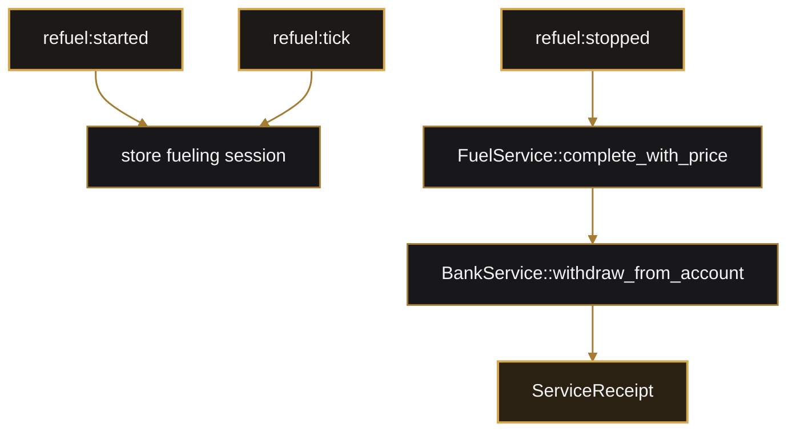

# Refuel Feature

Main files:
- `lib/src/models/fuel.rs`
- `lib/src/models/service.rs`
- `lib/src/models/transaction.rs`
- `lib/src/services/refuel.rs`
- `arma/crate/src/refuel.rs`
- `arma/crate/src/features/refuel/*`

## Mechanics

### Refueling Flow
Refuel supports session-based refueling from Arma events and direct refuel completion commands. Completed refuels charge the player bank account through `BankService` and return a `ServiceReceipt`. Refuel prices are read from `CfgMission >> Services >> Refuel`, with Rust defaults used by the domain service if a caller does not provide custom pricing.

## Current Commands
- `refuel:started`
- `refuel:tick`
- `refuel:stopped`
- `refuel:price`
- `refuel:quote`
- `refuel:complete`
