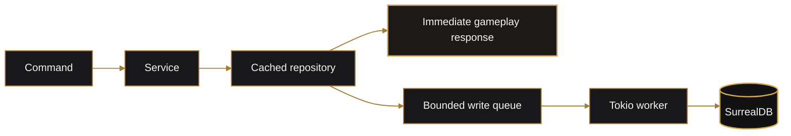
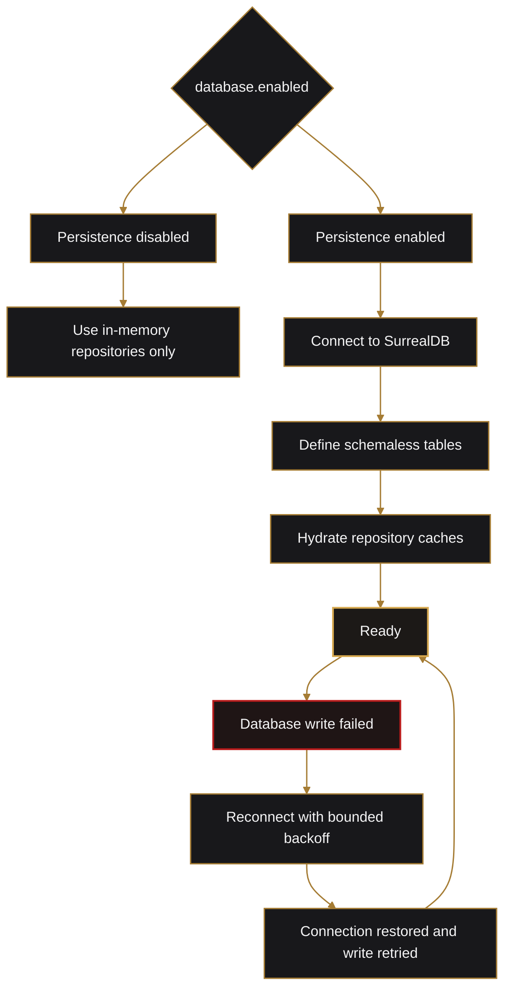

# Persistence

Forge uses hot in-memory repositories with an asynchronous SurrealDB write worker.

## Core Model



Reads are served from memory. Normal saves update memory and enqueue database work. Gameplay threads do not wait for file logging or database I/O.

## Startup and Hydration



Status commands:

- `database_status`: returns state plus queued/dropped counts.
- `database_ready`: returns a boolean readiness gate.

Actor initialization polls `database_ready` every 250 ms. This prevents a cold-start race where an existing actor could be treated as missing before hydration completes.

Persistence disabled means immediately ready because the in-memory repositories are authoritative for that process.

## Configuration

Copy `arma/crate/config.example.toml` to `config.toml` and set:

```toml
[database]
enabled = true
endpoint = "127.0.0.1:8000"
namespace = "forge"
database = "forge"
username = "root"
password = "root"
channel_capacity = 1024
reconnect_initial_ms = 250
reconnect_max_ms = 5000
```

Override the config path with `FORGE_SERVER_CONFIG`.

## Tables

The extension defines these schemaless tables automatically:

| Table | Contents | Hydrated |
| --- | --- | --- |
| `actor` | Actor state and snapshots | Yes |
| `bank` | Player bank profiles | Yes |
| `garage` | Physical garage records | Yes |
| `locker` | Physical locker commodity maps | Yes |
| `notification` | Player notifications | Yes |
| `organization` | Organizations and membership | Yes |
| `organization_invite` | Organization invites | Yes |
| `v_garage` | Virtual garage unlocks | Yes |
| `v_locker` | Virtual arsenal unlocks | Yes |
| `audit_record` | Durable audit rows | No runtime cache |
| `domain_event` | Serialized domain-event history | No runtime cache |

Malformed records are skipped during hydration and logged.

## Queue Semantics

The write queue is bounded by `channel_capacity`.

- `try_send` keeps gameplay nonblocking.
- full or unavailable queues increment the dropped counter.
- the worker retries database writes with bounded exponential backoff.
- a failed write remains in the worker retry loop until it succeeds.

Because caches update before durable writes complete, operational monitoring of logs and `database_status` is required.

## Multi-Record Transactions

`WriteOp::Batch` is translated into:

```text
BEGIN TRANSACTION
UPSERT/DELETE each operation
COMMIT TRANSACTION
```

Organization payday uses one batch for:

- organization debit.
- every recipient bank credit.

Player bank transfer uses repository batch saving for both profiles. This prevents a persisted one-sided transfer.

## Durable Events

The durable event backend can queue one batch containing:

- `domain_event`.
- `audit_record`.
- one or more `notification` rows.

Notifications are also placed in the in-memory notification repository immediately.

## Reconnect Caveat

The current worker reconnects after a write failure and retries the operation. Initial startup performs table definition and full hydration before setting readiness. A reconnect during the active write loop does not currently re-run full cache hydration; the in-process caches remain authoritative.

## Adding a Persistent Domain

1. Add shared model and repository trait.
2. Add an in-memory repository.
3. Add a cached server repository.
4. Add a `LazyLock` repository instance.
5. Add its table to `TABLES`.
6. Add it to `HydratedRecords`.
7. Select and cache it during hydration.
8. Use `enqueue_upsert`, `enqueue_delete`, or a batch.
9. Add tests and update this table list.
