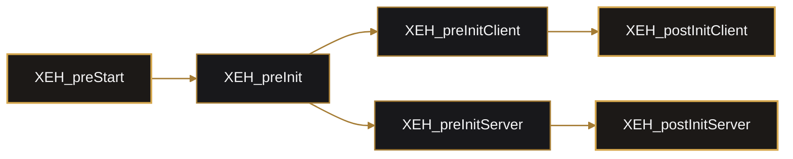
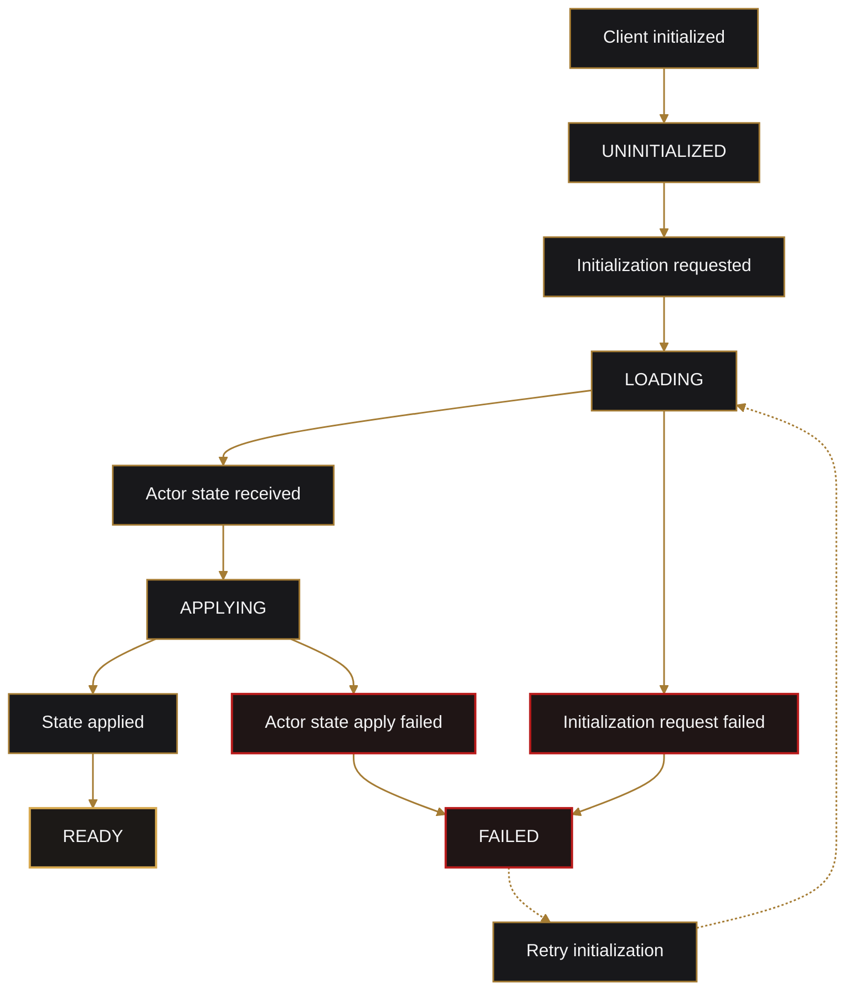

# SQF Addons and Lifecycle

## Addon Inventory

Current `forge_crate` addons:

| Addon | Responsibility |
| --- | --- |
| `main` | Shared macros, versioning, and the single native extension callback bridge. |
| `common` | Shared SQF helpers such as config money parsing and UID player lookup. |
| `extension` | Direct extension calls, request staging, and chunk assembly. |
| `actor` | Player snapshot capture, initialization, restore, save, and disconnect. |
| `bank` | Bank initialization and Eden bank-terminal registration. |
| `webui` | Browser display, JSDialog routing, authoritative bank requests, browser responses. |
| `notification` | Notification queries and join-time delivery. |
| `organization` | Default organization initialization and server-facing org helpers. |
| `garage` | Physical garage initialization chain. |
| `locker` | Physical personal locker proxy and persistence handshake. |
| `v_garage` | Virtual garage enablement and unlock persistence. |
| `v_locker` | ACE Arsenal integration and unlock persistence. |
| `commander` | Dynamic AI commander and virtualization. |
| `economy` | Reserved economy addon surface; currently contains no feature functions. |

## Extended Event Handler Lifecycle

Typical addon phases:



- `XEH_PREP.hpp` registers compiled functions during pre-init.
- `initSettings.inc.sqf` registers CBA settings.
- pre-init handlers register CBA events before gameplay.
- post-init handlers discover Eden objects and attach runtime interactions.

## Naming

Compiled SQF functions resolve to:

```text
forge_crate_<component>_fnc_<name>
```

Examples:

- `forge_crate_actor_fnc_capture`
- `forge_crate_bank_fnc_register`
- `forge_crate_webui_fnc_open`

Macro usage:

- `FUNC(name)`: function in the current addon.
- `EFUNC(component,name)`: function in another Forge addon.
- `GVAR(name)`: current-addon variable.
- `EGVAR(component,name)`: variable or event namespace in another addon.
- `QGVAR`/`QEGVAR`: quoted names.
- `CFUNC(name)`: CBA function.

## CBA Event Boundaries

Use:

- `CBA_fnc_localEvent` for same-machine orchestration.
- `CBA_fnc_serverEvent` for client-to-server requests.
- `CBA_fnc_targetEvent` for server-to-specific-client responses.

Do not pass another domain's full persistence payload through a coordinating event. Request the domain operation and receive a correlation result.

### Locker Save Handshake

```mermaid
%%{init: {"theme":"base","themeVariables":{"background":"transparent","actorBkg":"#18181b","actorBorder":"#a57c34","actorTextColor":"#f4f4f5","signalColor":"#d6a84f","signalTextColor":"#f4f4f5","labelBoxBkgColor":"#18181b","labelBoxBorderColor":"#a57c34","labelTextColor":"#f4f4f5"}}}%%
sequenceDiagram
    participant UI as Inventory UI
    participant Locker as Locker addon
    participant Actor as Actor addon
    participant Server as Server handlers

    UI->>Locker: InventoryClosed
    Locker->>Actor: actor.saveRequested(requestId)
    Actor->>Server: actor save snapshot
    Server-->>Locker: actor.saveResult(requestId, success)
    Locker->>Server: locker commit only when success=true
```

This ordering closes the duplication window without coupling actor data into locker commands.

## Extension Callback Bridge

Only `main/XEH_preInitServer.sqf` registers `ExtensionCallback`.

Rust callback namespace:

```text
forge:<feature>
```

Callback:

```text
name=forge:refuel, function=price
```

becomes:

```text
forge_crate_refuel_price
```

Feature addons subscribe to their routed CBA event instead of registering another raw extension callback.

## Eden Terminal Discovery

Bank:

- scans `bank` and `bank_1` through `bank_999`.
- adds `Open Bank`.
- emits `forge_crate_bank_openRequested`.

Locker:

- scans `locker` and `locker_1` through `locker_999`.
- clears and locks the placed terminal cargo on the server.
- creates a player-specific networked proxy for inventory interaction.

Virtual Locker:

- uses the same `locker*` terminals.
- adds `Open Virtual Arsenal`.
- opens a Forge-owned ACE Arsenal box.

## Actor Lifecycle

Client state:



The lifecycle hashmap is synchronization metadata, not a second actor repository.

## Function Headers

Public and internal SQF functions use a consistent header:

- file.
- author.
- date and last update.
- public visibility.
- description.
- arguments.
- return value.
- example.

Keep argument type constraints in `params` aligned with the documented contract.
