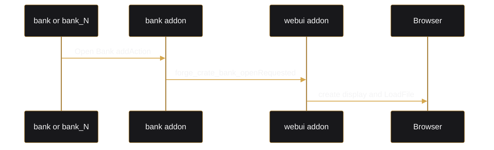
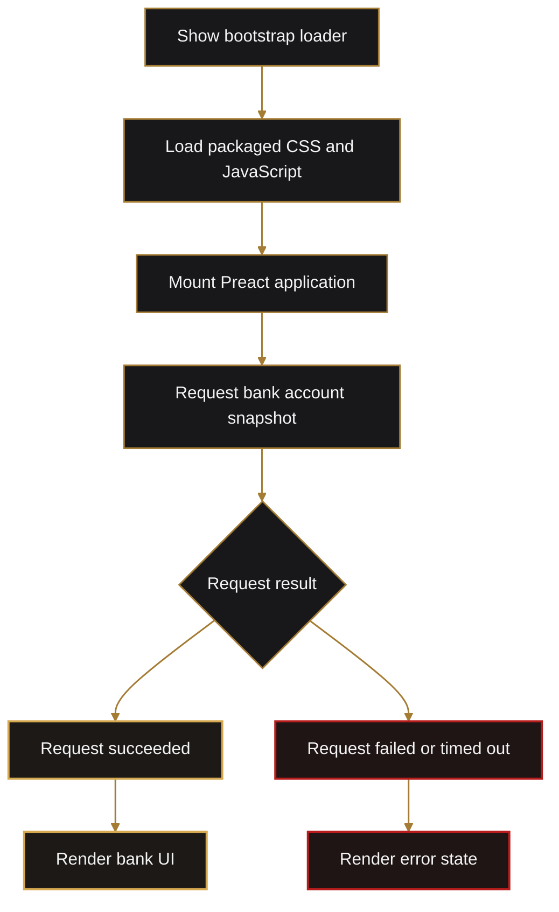

# WebUI and Browser Bridge

## Current UI

The active application is a bank-only Preact interface in:

```text
webui/src/
```

Three.js map source remains in the repository but is not imported by the active application bundle.

The bank UI provides:

- cash, bank balance, and pending earnings.
- a generated player bank card.
- deposit and withdrawal.
- player-to-player transfer.
- pending earnings submission.
- organization name, role, and read-only funds snapshot.
- ATM PIN setup or change.
- a ledger capped at ten records.
- dark and light themes, with dark as the default.
- static asset and live-data loading states.

## Display

SQF display:

```text
Forge_WebUI_Display
IDD 78000
browser IDC 78001
```

The browser occupies the safe-zone display and renders its own native-style title bar. The content pane owns scrolling; the title bar stays fixed.

## Opening the UI



## Asset Packaging

Normal Vite URLs are not usable from Arma's opaque browser origin.

`npm run build:arma`:

1. Builds the Preact bundle.
2. Copies the hashed CSS and JavaScript into stable `_site/style.css` and `_site/script.js`.
3. Generates `_site/index.html`.
4. Uses `A3API.RequestFile` to retrieve both assets.
5. Injects CSS and JavaScript into the document.

The generated HTML includes an inline loader so the user sees feedback before external assets are available.

Do not edit files under `arma/crate/addons/webui/ui/_site` manually.

## Request Contract

Browser request:

```json
{
  "requestId": "timestamp-sequence",
  "event": "bank::load",
  "data": {}
}
```

Response:

```json
{
  "requestId": "timestamp-sequence",
  "event": "bank::load",
  "ok": true,
  "data": {},
  "error": ""
}
```

`webui/src/bridge/host.ts` owns request correlation, timeouts, and push listeners.

## Bank Routes

Implemented browser routes:

- `bank::load`
- `bank::deposit`
- `bank::withdraw`
- `bank::transfer`
- `bank::submit_earnings`
- `bank::change_pin`
- `ui::close`

Unknown namespaces are ignored by the current SQF router.

## Browser Compatibility Constraints

Arma loads the packaged page through an opaque data/blob origin.

Consequences:

- `localStorage` may throw a security exception. Access is guarded; themes remain switchable for the current display session and default to dark when reopened.
- Unicode masking glyphs can be decoded incorrectly by the file bridge. Security masks use ASCII asterisks.
- Prefer conservative Chromium-compatible CSS. Avoid relying on recently introduced functions without an in-game test.
- JavaScript exceptions before Preact mount leave only the static page background and loader.

## Loading States



## Adding Another UI Feature

1. Add a feature component under `webui/src/features`.
2. Add request helpers using `requestFromArma`.
3. Extend `fnc_route.sqf` with the namespace.
4. Add a server CBA handler that owns authorization and extension calls.
5. Return the standard response envelope through `forge_crate_webui_fnc_send`.
6. Add an Eden interaction or other deliberate entry point.
7. Run `npm run build:arma` and test inside Arma.

See [Custom UI Extensibility](custom-ui-extensibility.md) for a longer example.
